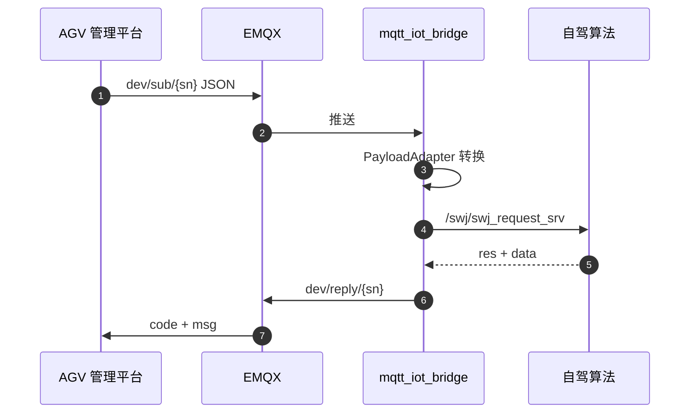

# 云平台下发指令

> 本文档定义云平台通过 `dev/sub/{clientId}` 下发的指令，车辆通过 `dev/reply/{clientId}` 回复。

---

## 一、RPC 机制概述

### 1.1 通信流程



### 1.2 通用格式

**请求**：

```json
{ "id": 1686004858937364480, "time": 1740469352000, "type": "2010001", "data": {} }
```

**回复**：

```json
{ "id": 1686004858937364480, "code": 200, "msg": "ok", "time": 1740469352100, "type": "2010001", "data": {} }
```

### 1.3 注意事项

1. `id` 由云平台生成（雪花算法），车辆回复时原样回传
2. 除 2010005 遥控外，所有指令 **QoS=2**，必须等待 dev/reply
3. 2010005 遥控默认 **不要求回复**（requireAck=false），QoS=0
4. 车辆应在 **5 秒内** 回复（2010005 除外）

---

## 二、IOT 方案指令（§7，原样复用）

> 以下各节与《车辆IOT实现方案》第 7 章 **字段、Topic、QoS、回复格式一致**。拓展内容见各节末尾「拓展」小节或第三章。

### 2.1 2010001 下发任务（IOT §7.1）

**描述**：下发任务给车辆立即执行。

| 项目 | 值 |
| ---- | -- |
| Topic | `dev/sub/{clientId}` |
| retain | false |
| QoS | 2 |

**请求 data 字段**（与 IOT 方案一致）：

| 字段 | 类型 | 说明 |
| ---- | ---- | ---- |
| taskId | String | 任务 id |
| taskName | String | 任务名称 |
| returnPoint | String | 返航点 |
| active | Boolean | 是否开启 |
| cycleDays | Integer[] | 循环天数 |
| cycleType | String | EVERY_WEEK / ODD_WEEK / EVEN_WEEK |
| executionMode | String | IMMEDIATE-立即执行 / SCHEDULED-计划任务 |
| startTime | String | 执行时间 hh:mm |
| taskNodes | List | 任务节点列表 |

**taskNodes 节点**：

| 字段 | 类型 | 说明 |
| ---- | ---- | ---- |
| order | Integer | 节点顺序 |
| taskPoint | String | 节点名字 |
| duration | String | 停留时间 |

**请求示例**：

```json
{
  "id": 1686004858937364480,
  "time": 1740469352000,
  "type": "2010001",
  "data": {
    "taskId": "T001",
    "taskName": "早班巡检",
    "returnPoint": "充电站1",
    "active": true,
    "executionMode": "IMMEDIATE",
    "cycleDays": [1, 2, 3, 4, 5],
    "cycleType": "EVERY_WEEK",
    "startTime": "08:00",
    "taskNodes": [
      { "order": 1, "taskPoint": "站点A", "duration": "60" },
      { "order": 2, "taskPoint": "站点B", "duration": "0" }
    ]
  }
}
```

**车辆回复**（Topic: `dev/reply/{clientId}`，QoS: 2）：

```json
{
  "id": 1686004858937364480,
  "code": 200,
  "msg": "ok",
  "time": 1740469352100,
  "type": "2010001",
  "data": {}
}
```

| 字段 | 类型 | 说明 |
| ---- | ---- | ---- |
| code | Integer | 200-成功，500-失败 |
| msg | String | 描述 |

#### 拓展 A：taskNodes 增加坐标（bridge 转 ICD 所需）

IOT 方案未定义坐标，车端 bridge 下发导航需坐标时 **追加**（不影响 IOT 解析）：

```json
{ "order": 1, "taskPoint": "站点A", "duration": "60", "x": 21.64, "y": 86.28, "z": 0.694, "w": 0.719 }
```

#### 拓展 B：taskSteps 组合任务（IDK 商用巡检咨询版）

在 IOT `data` 中 **追加** `taskSteps` 数组，用于目标点导航、动作任务、自定义路线、充电等混合编排：

| stepType | 说明 | ICD |
| -------- | ---- | --- |
| GOAL_NAV | 目标点导航 | start_task + goal_nav |
| ACTION | 动作任务 | debug_custom_action |
| CUSTOM_ROUTE | 自定义路线 | custom_route_nav |
| CHARGING | 充电 | go_charging |

```json
{
  "taskId": "T002",
  "taskName": "巡检组合",
  "executionMode": "IMMEDIATE",
  "taskSteps": [
    { "order": 1, "stepType": "GOAL_NAV", "taskPoint": "A", "duration": "30", "x": 21.64, "y": 86.28, "z": 0.694, "w": 0.719 },
    { "order": 2, "stepType": "ACTION", "actionType": "rotate_rad", "angle_rad": 1.57 },
    { "order": 3, "stepType": "CUSTOM_ROUTE", "routeJoinMode": "from_start", "waypoints": [{ "x": 30, "y": 25, "z": 0, "w": 1 }] },
    { "order": 4, "stepType": "CHARGING", "taskPoint": "充电站1", "x": 10, "y": 5, "z": 0, "w": 1 }
  ]
}
```

> 有 `taskSteps` 时按步骤顺序执行；仅有 `taskNodes` 时按 IOT 方案逻辑处理。

#### 拓展 C：ICD 直传

`data` 含 ICD JSON（`type: start_task` 等）时 bridge 原样转发 ROS，信封仍用 2010001。

---

### 2.2 2010002 修改参数（IOT §7.2）

**描述**：修改车辆配置，例如车灯、雷达或文件配置。

| 项目 | 值 |
| ---- | -- |
| Topic | `dev/sub/{clientId}` |
| QoS | 2 |

**data 字段**（IOT 方案 flat 结构）：

| 字段 | 类型 | 说明 |
| ---- | ---- | ---- |
| brake | Integer | 1-开启制动，0-取消制动 |
| headlights | Integer | 1-开启，0-关闭 |
| ultrasonic | Integer | 1-开启，0-关闭 |
| screen | Integer | 1-开启，0-关闭 |
| turnSignals | Integer | 0-全灭，1-左转，2-右转，3-双闪 |

**请求示例**：

```json
{
  "id": 1686004858937364480,
  "time": 1740469352000,
  "type": "2010002",
  "data": {
    "headlights": 1,
    "turnSignals": 0,
    "brake": 0,
    "ultrasonic": 1,
    "screen": 1
  }
}
```

**车辆回复**：同 2.1，`type` 回传 `2010002`，`data` 暂无附加字段。

#### 拓展：车辆控制 target 模型

在 IOT flat 字段之外，**追加** `target` + `command` + `params` 控制扩展设备：

| target | 说明 |
| ------ | ---- |
| ARM | 机械臂 |
| GIMBAL | 云台 |
| CONTAINER | 货柜（出货见 2010003，此处为门/机构控制） |
| AUDIO | 声音/语音 |
| LIGHT | 灯光（与 flat headlights/turnSignals 等效） |
| POWER | 电源/传感器供电 |
| NAV_CONFIG | 导航参数、离线策略 |

```json
{
  "type": "2010002",
  "data": {
    "target": "GIMBAL",
    "command": "SET",
    "params": { "pan": 15, "tilt": -5, "zoom": 1.5 }
  }
}
```

> IOT flat 与 target 模型可单独使用，也可在同一条 data 中并存。

---

### 2.3 2010003 通知出货（IOT §7.3）

**描述**：通知带有货柜的车辆出货。

| 项目 | 值 |
| ---- | -- |
| Topic | `dev/sub/{clientId}` |
| QoS | 2 |

**data**：

| 字段 | 类型 | 说明 |
| ---- | ---- | ---- |
| orderId | String | 订单 id |

```json
{ "type": "2010003", "data": { "orderId": "ORD001" } }
```

**车辆回复**：同 2.1，`type` 回传 `2010003`。

---

### 2.4 2010004 开启视频（IOT §7.4）

**描述**：视频推流开关。开启后云平台 **周期下发**；车辆若间隔 n 个周期未收到则关闭推流；推流地址变化则更新。

| 项目 | 值 |
| ---- | -- |
| Topic | `dev/sub/{clientId}` |
| QoS | 2 |

**data**：

| 字段 | 类型 | 说明 |
| ---- | ---- | ---- |
| status | Integer | 1-开启，0-关闭 |
| view | Integer | 1-前，2-右，3-后，4-左 |
| url | String | 推流地址 |

```json
{
  "type": "2010004",
  "data": { "status": 1, "view": 1, "url": "rtmp://stream.example.com/live/agv001" }
}
```

#### 拓展：心跳参数化

追加 `heartbeatIntervalSec`（默认 5）、`maxMissedHeartbeats`（默认 3）。

---

### 2.5 2010005 遥控车辆（IOT §7.5）

**描述**：远程遥控车辆指令。

| 项目 | 值 |
| ---- | -- |
| Topic | `dev/sub/{clientId}` |
| QoS | 2（IOT 原文） |

**data**（IOT 方案）：

| 字段 | 类型 | 说明 |
| ---- | ---- | ---- |
| speed | Integer | 速度 |
| angle | Integer | 角度 |

```json
{ "type": "2010005", "data": { "speed": 50, "angle": 0 } }
```

**车辆回复**：**无需回复**（IOT 方案 §7.5）。

#### 拓展：AGV 远程遥操

追加 `command` / `speedLevel` / `cameraPan` / `cameraTilt` / `cameraZoom` / `seq`；高频下发时 QoS 可降为 0。`speed`+`angle` **继续兼容**。

---

### 2.6 2010006 查看车辆配置（IOT §7.6）

**描述**：查看车辆配置。

**请求 data**：

| 字段 | 类型 | 说明 |
| ---- | ---- | ---- |
| name | String | 参数名 |

**回复 data**（IOT 方案，注意原文 type 笔误为 2010002，应以 2010006 回传）：

| 字段 | 类型 | 说明 |
| ---- | ---- | ---- |
| brake | Integer | 1-紧急制动，0-正常 |
| headlights | Integer | 1-开启，0-关闭 |
| ultrasonic | Integer | 1-开启，0-关闭 |
| screen | Integer | 1-开启，0-关闭 |
| turnSignals | Integer | 0-全灭，1-左转，2-右转，3-双闪 |

---

### 2.7 2010007 获取车辆点位信息（IOT §7.7）

**描述**：获取车辆当前所有点位信息。

**请求**：`type: 2010007`，data 可为空对象。

**回复 data**（IOT 方案）：

```json
{
  "code": 200,
  "msg": "ok",
  "data": ["点位1", "点位2"]
}
```

#### 拓展：结构化点位

追加 `points[]`（name/type/x/y/heading），保留字符串列表兼容。

---

### 2.8 2010008 紧急开关操作（IOT §7.8）

IOT 方案指令类型表已定义，数据结构由实现补充：

```json
{
  "type": "2010008",
  "data": { "action": "EMERGENCY_STOP" }
}
```

| action | 说明 |
| ------ | ---- |
| EMERGENCY_STOP | 紧急停止 |
| RELEASE | 解除 |

---

## 三、v1.0 拓展指令（IOT 方案未定义，追加）

### 3.1 2010009 任务控制

映射 ICD suspend/resume/stop/change_task：

```json
{
  "type": "2010009",
  "data": {
    "action": "PAUSE",
    "taskId": "T20250606001",
    "reason": "临时避让"
  }
}
```

| action | ICD type | 说明 |
| ------ | -------- | ---- |
| PAUSE | suspend_task | 暂停 |
| RESUME | resume_task | 恢复 |
| CANCEL | stop_task | 停止 |
| CHANGE_SPEED | change_task | 改速，需附加 speed 字段 |

---

### 3.2 2010010 定位校准

满足 AGV §2.1.3：

```json
{
  "type": "2010010",
  "data": {
    "mode": "MANUAL",
    "referencePoint": { "x": 0.0, "y": 0.0, "z": 0.0, "w": 1.0 }
  }
}
```

| mode | 说明 |
| ---- | ---- |
| MANUAL | 指定基准点校准 |
| AUTO | 基于地图基准点自动校准 |

---

### 3.3 2010011 建图控制

满足 AGV §8.3：

```json
{
  "type": "2010011",
  "data": {
    "action": "START",
    "params": { "resolution": 0.05, "enableDynamicFilter": true }
  }
}
```

| action | 说明 |
| ------ | ---- |
| START / PAUSE / RESUME / STOP | 扫图控制 |

---

### 3.4 2010012 地图同步

```json
{
  "type": "2010012",
  "data": {
    "mapType": "GRID",
    "version": "20250606_001",
    "url": "https://cdn.example.com/maps/warehouse.pgm",
    "md5": "abc123",
    "fileSize": 1048576
  }
}
```

---

## 四、指令汇总表

| type | 名称 | 来源 | QoS | 回复 |
| ---- | ---- | ---- | --- | ---- |
| 2010001 | 下发任务 | **IOT §7.1** + 拓展 | 2 | 是 |
| 2010002 | 修改参数 | **IOT §7.2** + 拓展 | 2 | 是 |
| 2010003 | 通知出货 | **IOT §7.3** | 2 | 是 |
| 2010004 | 开启视频 | **IOT §7.4** + 拓展 | 2 | 是 |
| 2010005 | 遥控车辆 | **IOT §7.5** + 拓展 | 2 | **否** |
| 2010006 | 查看配置 | **IOT §7.6** | 2 | 是 |
| 2010007 | 获取点位 | **IOT §7.7** + 拓展 | 2 | 是 |
| 2010008 | 紧急开关 | **IOT §7.8** | 2 | 是 |
| 2010009 | 任务控制 | v1.0 拓展 | 2 | 是 |
| 2010010 | 定位校准 | v1.0 拓展 | 2 | 是 |
| 2010011 | 建图控制 | v1.0 拓展 | 2 | 是 |
| 2010012 | 地图同步 | v1.0 拓展 | 2 | 是 |

---

## 相关文档

- [载荷映射](protocol-mapping.md)
- [状态机](protocol-state-machine.md)
- [协议调整说明](protocol-revision.md)
