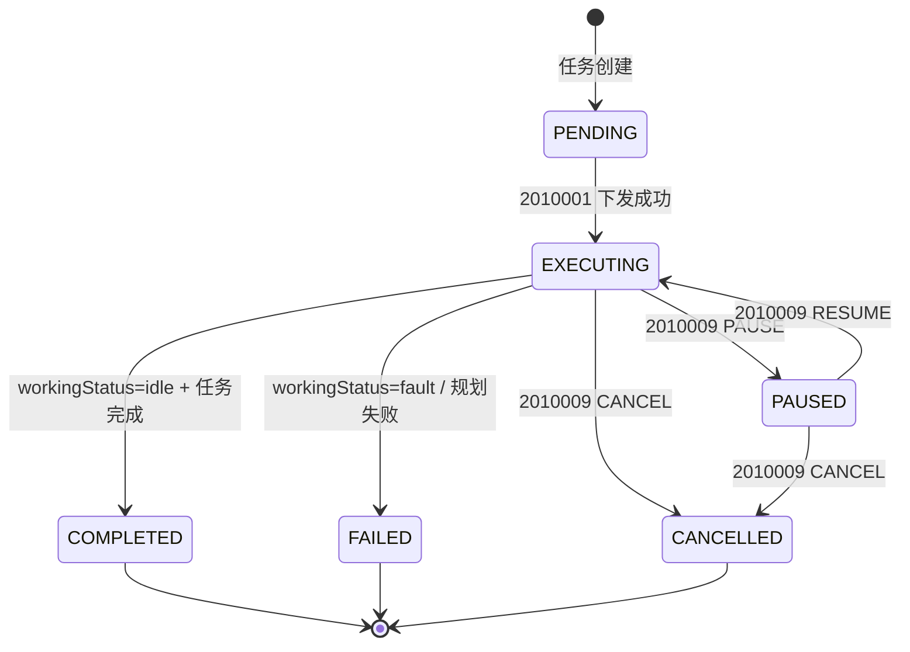
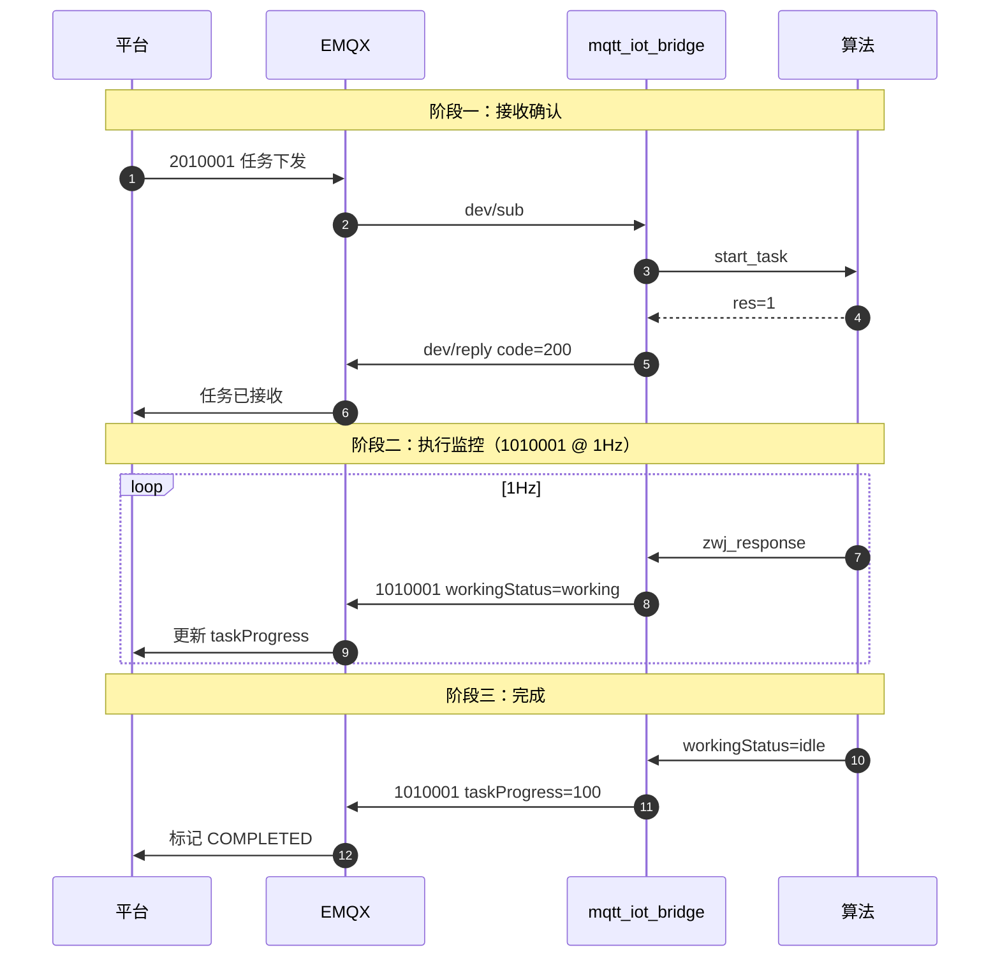
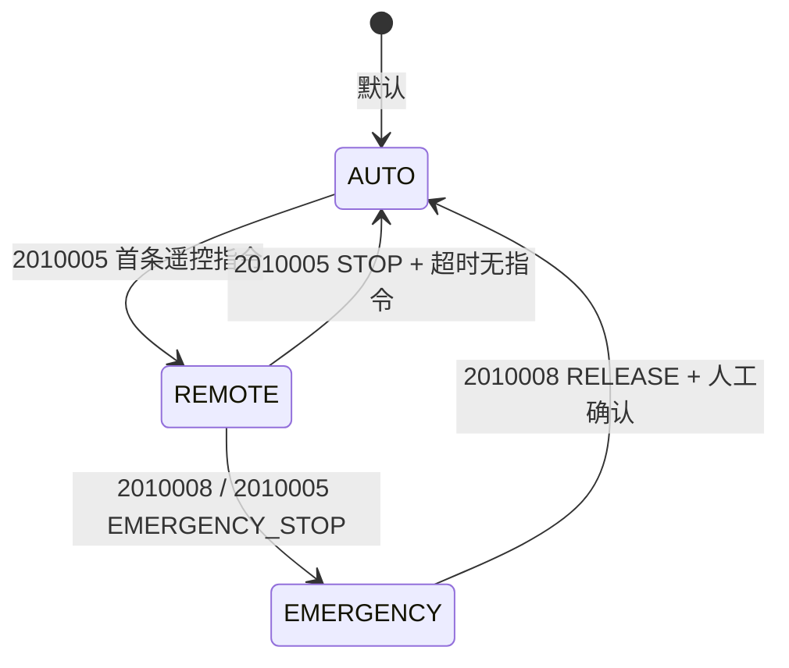

# 状态机设计

> 本文档定义 AGV 管理平台简化状态与 ICD 细粒度状态之间的映射关系。

---

## 一、平台任务状态机

AGV 管理平台使用 **6 个简化状态**，与 ICD `workingStatus` / `planningStatus` 映射。

### 1.1 状态转换规则

| 当前状态 | 可转换至 | 触发条件 |
| -------- | -------- | -------- |
| PENDING | EXECUTING | dev/reply code=200 |
| EXECUTING | PAUSED | 2010009 PAUSE 或 planningStatus=pausing |
| EXECUTING | COMPLETED | workingStatus=idle 且 taskProgress=100 |
| EXECUTING | FAILED | workingStatus=fault 或 planningStatus 含 fault |
| EXECUTING | CANCELLED | 2010009 CANCEL |
| PAUSED | EXECUTING | 2010009 RESUME |
| PAUSED | CANCELLED | 2010009 CANCEL |

---

## 二、1010001 workStatus 映射

IOT 方案 `workStatus`（Integer）保持不变，映射规则：

| workStatus | 平台展示 | ICD 条件 |
| ---------- | -------- | -------- |
| 0 | 空闲 | workingStatus=idle |
| 1 | 任务中 | workingStatus=working 或 initializing |
| 2 | 故障 | workingStatus=fault |
| 3 | 充电 | vehicleInfo.vehicleChargingStatus=1 |
| 4 | 急停 | planningStatus=emergency_stop |
| 5 | 离线 | 平台判定（online_status disconnected） |

---

## 三、ICD 状态 → 平台监控

### 3.1 localizationStatus

| ICD 值 | 平台处理 | AGV 需求 |
| ------ | -------- | -------- |
| normal | 正常显示 | — |
| initialization | 显示"定位初始化中" | — |
| gps_fault | **定位异常报警** | §2.1.3 |
| localization_fault | **定位异常报警** | §2.1.3 |

### 3.2 planningStatus

| ICD 值 | 平台处理 |
| ------ | -------- |
| normal | 正常行驶 |
| obstacle_avoidance | 触发 1010005 避障事件 |
| recovery_planning | 触发 1010005 重规划事件 |
| emergency_stop | workStatus=4，**紧急报警** |
| robot_stop | 显示"停车中" |
| parking_courtesy | 触发 1010005 让行事件 |
| fault_* | workStatus=2 |

### 3.3 drivingMode

| ICD 值 | 平台展示 | 触发条件 |
| ------ | -------- | -------- |
| auto_drive | 自动模式 | 默认 |
| manual_drive | 手动模式 | 本地操作 |
| remote_drive | 遥控模式 | 2010005 遥控期间 |

---

## 四、任务执行监控流程

### 4.1 超时检测

| 阶段 | 预期 | 超时 | 处理 |
| ---- | ---- | ---- | ---- |
| 接收确认 | dev/reply code=200 | 5s | 标记通信异常，可重试 |
| 开始执行 | workingStatus=working | 60s | 查询 2010006 或告警 |
| 任务完成 | taskProgress=100 | 按任务类型配置 | 标记 FAILED |

---

## 五、遥控模式状态

遥控期间 `drivingMode=remote_drive`，平台监控界面须同步显示视频（2010004）。

---

## 相关文档

- [周期性上报](protocol-telemetry.md)
- [云平台下发](protocol-rpc-server.md)
- [枚举定义](protocol-enums.md)
