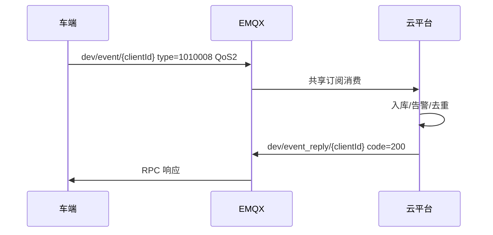
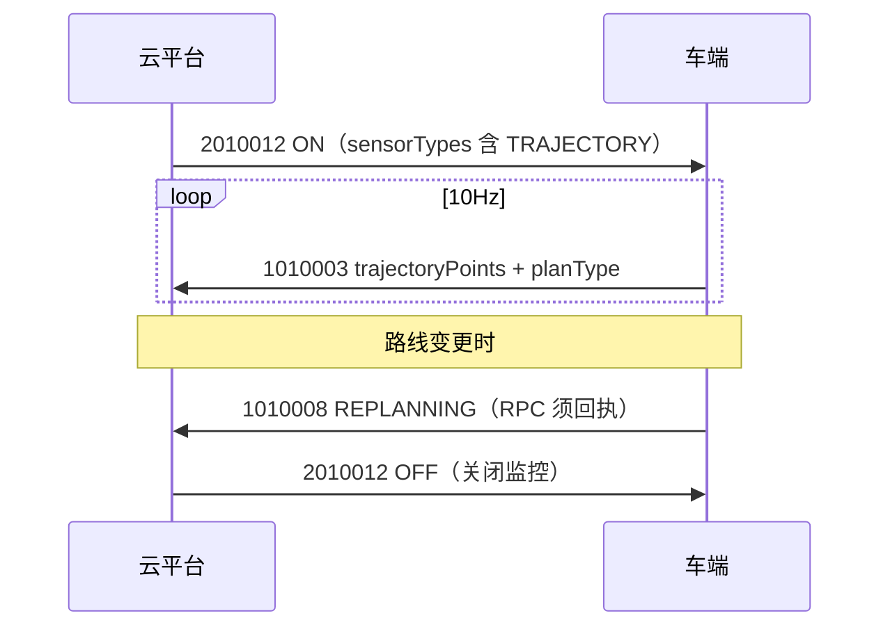

# 云平台-机器人通信协议 V1.0.0（内部标准版）

## 修订历史

| 日期 | 版本 | 描述 | 作者 |
| ---- | ---- | ---- | ---- |
| 2026-06-26 | V1.0.0-INTERNAL-R13 | 移除 §5.8 业务能力对照；修正 §5.6/§5.7 章节顺序 | — |

---

## 1 编写目的

记录 AGV / 巡检 / 无人车与云管理平台之间的通信协议，作为云平台、前端及车端 MQTT 适配层的开发规范。

通讯链路：云管理平台 ── EMQX（MQTT）──► 车端 MQTT 适配层 ──► 车端业务软件

MQTT 周期报文与 Client-side RPC 在同一文档内分篇编排（见 §5.0）。

---

## 文档目录

| 部分 | 章节 | Topic | 说明 |
| ---- | ---- | ----- | ---- |
| 共用 | §1~§5、§8 | — | 目的、流程、总则、枚举、拓展 |
| **第一篇 MQTT 报文** | §6 车辆上行、§7 云平台下行 | dev/pub、dev/sub、dev/reply | 周期上报、云下发指令 |
| **第二篇 Client-side RPC** | §9~§11 | dev/event、dev/event_reply | 感知事件、日志结果（须回执） |

Word 打开后可用导航窗格按「第一篇 / 第二篇 / §6.1 / §10.2」等标题跳转。

---

## 2 适用范围

云管理平台（云服务）与车辆端 MQTT 适配层之间的通信规范；前端、云端、车端开发联调参考。

- **第一篇（§6、§7）**：MQTT 周期上报与云下发指令（dev/pub、dev/sub、dev/reply）
- **第二篇（§9~§11）**：Client-side RPC 离散事件（dev/event、dev/event_reply）

导航相关模块（定位、建图、避障、路径规划）由车端业务软件负责，不在本协议范围内。

---

## 3 云平台服务组件

EMQX 5.8.4、MySQL 5.7、Redis 4.0 (1.9.1)

| 组件 | 版本 |
| ---- | ---- |
| EMQX | 5.8.4 |
| MySQL | 5.7 |
| Redis | 4.0 (1.9.1) |

---

## 4 IOT 交互流程

### 4.1 车辆注册

1：在云平台上注册车辆  
2：注册车辆后云平台提供秘钥文件下载  
3：将下载好秘钥文件保存到车辆指定位置  
4：给车辆配置 EMQX 服务信息  

### 4.2 车辆与 EMQX 建立连接

1：车辆启动读取 EMQX 相关的配置信息：秘钥文件、服务信息  
2：车辆与 EMQX 建立连接  
3：连接建立成功/失败  

注：EMQX 使用 mysql 用户认证插件（emqx_auth_mysql）：根据 mysql 注册的用户名和密码验证连接用户是否合法。

### 4.3 车辆在线离线状态

1：车辆连接 EMQX 或断开与 EMQX 的连接会触发上线/下线事件  
2：云服务在线则实时消费上线/下线事件，改变车辆在线状态  
3：云服务离线，EMQX 将上线/下线事件保存到队列，待云服务上线后再继续消费  

注：

- 上线事件 topic：$events/client_connected  
- 下线事件 topic：$events/client_disconnected  
- EMQX 规则引擎转发至普通 topic（设置 retain）：/mqtt/onoff/{sn}  
- 云平台共享订阅：$share/{app_name}/online_status/+  

部署时由规则引擎将 /mqtt/onoff/{sn} 转发至 online_status/{clientId}，本文档统一写作 online_status/{clientId}。

### 4.4 车辆接收云平台指令

1：云服务通过 EMQX 发布订阅消息，向车辆下发指令  
2：EMQX 向 dev/sub/{clientId} 发布事件  
3：车辆监听并处理消息  
4：车辆通过 dev/reply/{clientId} 回复执行结果  
5：云服务监听 dev/reply/+ 处理回复  

### 4.5 车辆数据上报云平台

1：车辆向 dev/pub/{clientId} 发布数据消息事件  
2：未及时消费的事件进入消息队列  
3：云服务消费数据消息事件并存储数据  

---

## 5 协议

### 5.0 文档分篇与阅读指引

| 篇 | 章节 | Topic | 适用场景 |
| -- | ---- | ----- | -------- |
| **第一篇 MQTT 报文** | §6 车辆上行、§7 云平台下行 | dev/pub、dev/sub、dev/reply | 周期状态/高频流、云下发指令、指令回执 |
| **第二篇 Client-side RPC** | §9~§11 | dev/event、dev/event_reply | 离散感知事件、日志提取结果；**须云端回执** |
| **共用** | §4 流程、§5 总则与枚举、§8 拓展 | — | 认证、枚举、产品线、统计 |

**选型原则**：周期数据走第一篇（dev/pub）；关键离散事件与须确认送达的上报走第二篇（dev/event RPC），**不得**与 1010001/1010003 混用 dev/pub。详见 §5.7。

### 5.1 Topic 描述

#### 5.1.1 第一篇：MQTT 报文 Topic

**车辆端订阅**

| Topic | 说明 |
| ----- | ---- |
| dev/sub/{clientId} | 订阅云服务下发指令 |

**车辆端发布**

| Topic | 说明 |
| ----- | ---- |
| dev/reply/{clientId} | 回复云平台指令执行结果 |
| dev/pub/{clientId} | 周期/触发类数据上报（1010001~1010004） |

**云服务订阅**

| Topic | 说明 |
| ----- | ---- |
| dev/reply/+ | 订阅车辆指令回复 |
| $share/{app_name}/dev/pub/+ | 订阅车辆周期上报（共享 topic） |
| $share/{app_name}/online_status/+ | 订阅车辆上线下线事件 |

**云服务发布**

| Topic | 说明 |
| ----- | ---- |
| dev/sub/{clientId} | 向车辆下发指令（含 1010002 确认回复） |

#### 5.1.2 第二篇：Client-side RPC Topic

**车辆端订阅**

| Topic | 说明 |
| ----- | ---- |
| dev/event_reply/{clientId} | 订阅云端对 RPC 请求的受理回执（§10） |

**车辆端发布**

| Topic | 说明 |
| ----- | ---- |
| dev/event/{clientId} | Client-side RPC 请求：感知事件、日志结果（§10） |

**云服务订阅**

| Topic | 说明 |
| ----- | ---- |
| $share/{app_name}/dev/event/+ | 订阅车辆 RPC 请求（共享 topic） |

**云服务发布**

| Topic | 说明 |
| ----- | ---- |
| dev/event_reply/{clientId} | 回复车辆 RPC 受理结果（§10） |

> RPC 详细约定、type 表及与 ThingsBoard method 映射见 **§9、§10**；本篇 Topic 仅列出与 MQTT 报文不同的 dev/event 通路。

### 5.2 认证密钥

**车辆客户端参数设置：**

| 项目 | 值 |
| ---- | -- |
| ClientId | 填车辆注册时的编号 |
| Username | 填车辆注册时的编号 |
| Password | 从秘钥文件（4.1 车辆注册获取）按照规则解析出密码 |
| Keep Alive | 60 秒（推荐） |

注：为了安全，解析规则由双方私下约定，不在协议中展示。

### 5.3 数据结构

**云平台给车辆下发的数据结构**

| 字段 | 类型 | 描述 |
| ---- | ---- | ---- |
| id | Long | 云平台下发数据时携带的 id，车辆回复时回传（雪花算法） |
| time | Long | 消息时间戳，单位毫秒 |
| type | String | 指令类型：AAABBBB，AAA 属于模块，BBBB 属于指令编码 |
| data | Object | 附加数据，根据业务需要承接实际数据体 |

```json
{
  "id": 1686004858937364480,
  "time": 1740469352000,
  "type": "2010001",
  "data": {}
}
```

**车辆收到云平台数据回复的数据结构**

| 字段 | 类型 | 描述 |
| ---- | ---- | ---- |
| id | Long | 回传云平台下发的 id |
| code | Integer | 200：成功；500：失败 |
| msg | String | 回复描述 |
| time | Long | 消息时间戳，单位毫秒 |
| type | String | 回传云平台携带的 type |
| data | Object | 附加数据 |

```json
{
  "id": 1686004858937364480,
  "code": 200,
  "msg": "ok",
  "time": 1740469352100,
  "type": "2010001",
  "data": {}
}
```

**车辆主动上报数据的数据结构**

| 字段 | 类型 | 描述 |
| ---- | ---- | ---- |
| id | Long | 车辆自定义，确保短时间内每条消息的 id 不一样 |
| time | Long | 消息时间戳，单位毫秒 |
| type | String | 指令类型，详情见 §5.5 指令类型表 |
| data | Object | 附加数据 |

```json
{
  "id": 1740469352001,
  "time": 1740469352000,
  "type": "1010001",
  "data": {}
}
```

### 5.4 通用约定

| 约定 | 说明 |
| ---- | ---- |
| id | 云下发用雪花算法；车回复原样回传 |
| time | 毫秒时间戳 |
| type | 格式 AAABBBB（AAA=模块，BBBB=编码） |
| 未知字段 | 接收方忽略不报错，可原样存储 |
| clientId | 车辆标识统一用 MQTT ClientId；**车端上报不得重复传 vehicleId**，云端通过 clientId 反查车辆档案 |
| 回复超时 | 第一篇：除 2010005 外，5 秒内 dev/reply；第二篇：dev/event RPC 建议 5 秒、最多重试 3 次（§9.1） |
| QoS | 第一篇：1010002、201xxxx（除 2010005）= 2；1010001/1010003 = 0；1010004 = 1；第二篇：1010006/1010008 = 2（§9.1） |

### 5.5 指令类型表（持续更新）

#### 5.5.1 第一篇：MQTT 报文 type

| 指令发起方 | type | 说明 |
| ---------- | ---- | ---- |
| 车辆 | 1010001 | 低频状态上报（§6.1） |
| 车辆 | 1010002 | 本地任务列表上报（§6.2） |
| 车辆 | 1010003 | 高频数据上报（§6.4） |
| 车辆 | 1010004 | 故障状态上报（§6.3） |
| 云平台 | 2010001 | 下发任务（§7.1） |
| 云平台 | 2010002 | 修改参数（§7.2） |
| 云平台 | 2010003 | 车辆出货（§7.3） |
| 云平台 | 2010004 | 开启视频（§7.4） |
| 云平台 | 2010005 | 遥控车辆（§7.5） |
| 云平台 | 2010006 | 查看车辆配置（§7.6） |
| 云平台 | 2010007 | 获取车辆点位信息（§7.7） |
| 云平台 | 2010008 | 紧急开关操作（§7.8） |
| 云平台 | 2010009 | 任务控制（§7.9，P1） |
| 云平台 | 2010010 | 获取车辆地图（§7.10，P1） |
| 云平台 | 2010011 | 日志提取触发（§7.11，P1）；结果回报见第二篇 §10.1 |
| 云平台 | 2010012 | 高频数据开关（§7.12，P1） |

#### 5.5.2 第二篇：Client-side RPC type

| 指令发起方 | type | 说明 |
| ---------- | ---- | ---- |
| 车辆 | 1010008 | 感知监测事件上报（§10.2） |
| 车辆 | 1010006 | 日志提取结果上报（§10.1） |

### 5.6 通用枚举定义

约定：**新增指令字段优先使用 String 枚举**；IOT 遗留整型字段（如 workStatus、brakeStatus）在报文中仍传数值，云平台展示与业务层统一映射为下列枚举名。

#### 5.6.1 WorkStatus（1010001.workStatus，整型传输）

| 枚举名 | 值 | 说明 |
| ------ | -- | ---- |
| IDLE | 0 | 空闲 |
| WORKING | 1 | 任务中 |
| FAULT | 2 | 故障 |
| CHARGING | 3 | 充电 |
| EMERGENCY_STOP | 4 | 急停 |

#### 5.6.2 BrakeStatus（1010001 / 2010006，整型传输）

| 枚举名 | 值 | 说明 |
| ------ | -- | ---- |
| OFF | 0 | 关闭 |
| ON | 1 | 开启 |

#### 5.6.3 VideoStatus（2010004.status，整型传输）

| 枚举名 | 值 | 说明 |
| ------ | -- | ---- |
| OFF | 0 | 关闭 |
| ON | 1 | 开启 |

#### 5.6.4 CameraView（2010004.view，整型传输）

| 枚举名 | 值 | 说明 |
| ------ | -- | ---- |
| FRONT | 1 | 前摄像头 |
| RIGHT | 2 | 右摄像头 |
| REAR | 3 | 后摄像头 |
| LEFT | 4 | 左摄像头 |

#### 5.6.5 TurnSignal（2010002.turnSignals，整型传输）

| 枚举名 | 值 | 说明 |
| ------ | -- | ---- |
| OFF | 0 | 全灭 |
| LEFT | 1 | 左转 |
| RIGHT | 2 | 右转 |
| HAZARD | 3 | 双闪 |

#### 5.6.6 ReturnPointType（2010001.returnPoint.tasktype，整型传输）

| 枚举名 | 值 | 说明 |
| ------ | -- | ---- |
| INVALID | 0 | 无效 |
| NAV_POINT | 1 | 导航点 |
| CHARGE_POINT | 2 | 充电点 |

#### 5.6.7 FaultLevel（1010004，整型传输）

| 枚举名 | 值 | 说明 |
| ------ | -- | ---- |
| OK | 1 | 正常 |
| WARN | 2 | 警告 |
| ERROR | 3 | 错误 |
| FATAL | 4 | 致命 |

#### 5.6.8 CycleType（2010001 / 1010002，String 枚举）

| 枚举名 | 说明 |
| ------ | ---- |
| EVERY_WEEK | 每周 |
| ODD_WEEK | 单周 |
| EVEN_WEEK | 双周 |

#### 5.6.9 ExecutionMode（2010001 / 1010002，String 枚举）

| 枚举名 | 说明 |
| ------ | ---- |
| IMMEDIATE | 立即执行 |
| SCHEDULED | 计划任务 |

#### 5.6.10 TaskControlAction（2010009.action，String 枚举）

| 枚举名 | 说明 |
| ------ | ---- |
| PAUSE | 暂停 |
| RESUME | 恢复 |
| CANCEL | 停止 |
| CHANGE_SPEED | 改速 |

#### 5.6.11 EmergencyAction（2010008.action，String 枚举）

| 枚举名 | 说明 |
| ------ | ---- |
| EMERGENCY_STOP | 紧急停止 |
| RELEASE | 解除 |

#### 5.6.12 RemoteDriveCommand（2010005.command，String 枚举）

| 枚举名 | 说明 |
| ------ | ---- |
| FORWARD | 前进 |
| BACKWARD | 后退 |
| LEFT | 左转 |
| RIGHT | 右转 |
| STOP | 停止 |
| EMERGENCY_STOP | 急停 |
| PAUSE | 暂停 |

#### 5.6.13 LogType（2010011.logType / 2010011.modules，String 枚举）

| 枚举名 | 说明 |
| ------ | ---- |
| SYSTEM | 系统日志 |
| NAVIGATION | 导航日志 |
| TASK | 任务日志 |
| FAULT | 故障日志 |
| SENSOR | 传感器日志 |
| MQTT | MQTT 连接日志 |
| RPC | RPC 通信日志 |
| ALL | 全部模块 |

#### 5.6.14 LogExtractStatus（1010006.status，String 枚举）

| 枚举名 | 说明 |
| ------ | ---- |
| ACCEPTED | 已受理（2010011 即时回复） |
| PACKAGING | 打包中 |
| UPLOADING | 上传中 |
| SUCCESS | 上传成功（终态，同 COMPLETED） |
| COMPLETED | 已完成（终态，同 SUCCESS） |
| FAILED | 失败（终态） |
| CANCELLED | 已取消 |

#### 5.6.15 MapFormat（2010010.format，String 枚举）

| 枚举名 | 说明 |
| ------ | ---- |
| PGM | 栅格地图 PGM |
| PNG | 栅格预览 PNG |
| YAML | 地图元数据 YAML |
| ZIP | 地图包（推荐） |

#### 5.6.16 StatMetric（云端运营统计指标，String 枚举）

| 枚举名 | 说明 |
| ------ | ---- |
| VEHICLE_COUNT | 车辆总数 |
| VEHICLE_COUNT_BY_MODEL | 车辆数量分布（按车型） |
| VEHICLE_MILEAGE | 车辆里程 |
| TASK_SUCCESS_RATE | 任务成功率 |
| SERVICE_STATION_COUNT | 服务站点数 |
| VEHICLE_PROVINCE_DISTRIBUTION | 车辆省界分布 |
| ONLINE_VEHICLE_LIST | 在线车辆列表 |

#### 5.6.17 ObstacleType（1010003.obstacles.type，String 枚举）

| 枚举名 | 说明 |
| ------ | ---- |
| PEDESTRIAN | 行人 |
| VEHICLE | 车辆 |
| STATIC | 静态障碍物 |
| UNKNOWN | 未知 |

#### 5.6.18 HighFreqStatus（2010012.status，String 枚举）

| 枚举名 | 说明 |
| ------ | ---- |
| ON | 开启高频上报 |
| OFF | 关闭高频上报 |

#### 5.6.19 HighFreqSensorType（2010012.sensorTypes / 1010003 字段块，String 枚举）

| 枚举名 | 对应 1010003 字段 | 说明 |
| ------ | ----------------- | ---- |
| RTK | x, y, z, yaw, pitch, roll, speedMps | 位姿 |
| TRAJECTORY | trajectoryPoints | 局部规划轨迹 |
| OBSTACLE | obstacles | 障碍物 |
| ULTRASONIC | ultrasonicSense | 超声波 |
| CHASSIS | yaw, pitch, roll | 底盘姿态（可与 RTK 合并上报） |

不传 `sensorTypes` 时默认开启全部类型。

#### 5.6.20 RoutePlanType（1010003.planType / 1010008 REPLANNING，String 枚举）

| 枚举名 | 说明 |
| ------ | ---- |
| INITIAL | 任务开始后首次全局路线规划 |
| UPDATE | 执行中路线调整（如避障后重规划） |

#### 5.6.21 PerceptionEventType（1010008.eventType，String 枚举）

| 枚举名 | 说明 |
| ------ | ---- |
| OBSTACLE_AVOIDANCE | 避障 |
| REPLANNING | 重规划 |
| YIELDING | 让行 |
| ABNORMAL_STOP | 异常停车 |
| TRAFFIC_LIGHT | 红绿灯场景 |
| BARRIER | 道闸场景 |
| CRASH | 碰撞 |
| PIPELINE | 管线缠绕 |
| WEAK_TRAFFIC | 弱交通场景 |
| PERCEPTION_ALERT | 感知告警（通用） |

#### 5.6.22 PerceptionEventStatus（1010008.eventStatus，String 枚举）

| 枚举名 | 说明 |
| ------ | ---- |
| START | 事件开始 |
| UPDATE | 事件进行中 |
| END | 事件结束 |
| DETECTED | 检测到（碰撞/弱交通/管线等） |
| RESOLVED | 已解除 |
| APPROACHING | 接近中（红绿灯/道闸） |
| QUEUEING | 道闸前排队中（BARRIER） |
| WAITING | 等待中 |
| PASSING | 通过中 |
| EXITING | 使出道闸（BARRIER） |
| PASSED | 已通过 |
| PARKING | 弱交通靠边停车中（WEAK_TRAFFIC） |

#### 5.6.23 AvoidanceAction（1010008.avoidanceAction，String 枚举）

| 枚举名 | 说明 |
| ------ | ---- |
| WAIT | 等待 |
| REROUTE | 绕路 |
| EMERGENCY_STOP | 急停 |

#### 5.6.24 TrafficLightColor（1010008.trafficLightColor，String 枚举）

| 枚举名 | 说明 |
| ------ | ---- |
| UNKNOWN | 未知 |
| RED | 红灯 |
| YELLOW | 黄灯 |
| GREEN | 绿灯 |
| BLACK | 黑灯 |

#### 5.6.25 TrafficLightDirection（1010008.direction，String 枚举）

| 枚举名 | 说明 |
| ------ | ---- |
| STRAIGHT | 直行 |
| LEFT | 左转 |
| RIGHT | 右转 |
| U_TURN | 掉头 |

#### 5.6.26 TrafficLightPosition（1010008.position，String 枚举）

| 枚举名 | 说明 |
| ------ | ---- |
| APPROACHING_5M | 距红绿灯约 5 米 |
| APPROACHING_10M | 距红绿灯约 10 米 |
| AT_STOP_LINE | 停止线前 |
| IN_INTERSECTION | 路口内 |

### 5.7 通路选型（摘要）

| 篇 | 通路 | Topic | 适用 type | QoS | 云端回复 |
| -- | ---- | ----- | --------- | --- | -------- |
| 第一篇 | MQTT 周期上报 | dev/pub | 1010001、1010003、1010004 | 0~1 | 不需要 |
| 第一篇 | MQTT 指令/回执 | dev/sub → dev/reply | 201xxxx、1010002 确认 | 2 | 指令须回执 |
| 第二篇 | Client-side RPC | dev/event → dev/event_reply | 1010006、1010008 | 2 | **必须** |

感知监测、日志结果等离散事件**必须**走第二篇 RPC 通路，不与 1010003 高频流共用 dev/pub。RPC 详细语义见 **§9~§11**。


---

## 第一篇 MQTT 报文协议

本篇约定 dev/pub / dev/sub / dev/reply 上的周期上报与指令交互。离散事件与日志结果见 **第二篇 §9~§11**。

## 6 车辆上行（MQTT）

车辆通过 dev/pub 主动上报，分为三类：

1. **低频综合状态（1010001）**：1Hz，常规监控与任务进度。  
2. **高频数据（1010003）**：10Hz ENU 位姿/轨迹/障碍物；由 **2010012** 控制，默认关闭（§7.12）。  
3. **故障状态（1010004）**：有活动故障时 1Hz 持续上报。

本地任务列表（1010002）在变更时上报，云平台经 dev/sub 回复确认。

**说明**：感知监测事件（1010008）、日志提取结果（1010006）属 **Client-side RPC**，不在本篇，见 **§10**。车队运营统计（§8.4）由云平台自行聚合。

### 6.1 1010001 车辆状态信息上报

描述：车辆 1Hz 定时上报自身综合状态，供云平台常规查看与任务编排。

| 项目 | 值 |
| ---- | -- |
| topic | dev/pub/{clientId} |
| retain | false |
| qos | 0 |
| type | 1010001 |
| 频率 | 1Hz |
| 平台回复 | 不需要 |

**data 字段**

| 字段 | 类型 | 必填 | 描述 |
| ---- | ---- | ---- | ---- |
| position | String | true | 车辆位置，经度,纬度,高程（如 "114.05129,22.508236,39.19"） |
| position_xyz | String | false | 地图坐标系位置，x,y,yaw（米,米,弧度）（P1 新增） |
| workStatus | Integer | true | WorkStatus 枚举，见 §5.6.1 |
| taskId | String | false | 当前执行任务的 id |
| isInNode | Boolean | false | 是否停留在站点 |
| inNodeName | String | false | 当前停留站点名字 |
| inNodeTime | Long | false | 预计当前站点停留时间（秒） |
| nextNodeName | String | false | 下一个站点名字 |
| nextNodeTime | Long | false | 预计下一站点路程时间（秒） |
| battery | Integer | true | 车辆电量 0-100 |
| brakeStatus | Integer | true | BrakeStatus 枚举，见 §5.6.2 |
| heading | Number | false | 航向角（度）（P1） |
| speedMps | Number | false | 速度（m/s）（P1） |
| taskProgress | Integer | false | 任务进度 0-100（P1） |
| localizationStatus | String | false | 定位状态：unknown/initialization/normal/gps_fault/localization_fault（P1） |
| workingStatus | String | false | 作业状态：idle/initializing/working/pausing/fault（P1） |
| planningStatus | String | false | 规划状态：normal/global_planning/recovery_planning/robot_stop 等（P1） |
| vehicleInfo | Object | false | 硬件摘要（P1） |
| sensorStatus | Object | false | 传感器在线状态（P1） |
| faultSummary | Object | false | 故障摘要 hasFault/faultCount/highestFaultLevel（P1） |

**请求示例**

```json
{
  "id": 1740469352001,
  "time": 1740469352000,
  "type": "1010001",
  "data": {
    "position": "114.05129,22.508236,39.19",
    "position_xyz": "21.64,86.28,1.42",
    "workStatus": 1,
    "taskId": "T001",
    "isInNode": false,
    "inNodeName": "",
    "inNodeTime": 0,
    "nextNodeName": "站点B",
    "nextNodeTime": 120,
    "battery": 85,
    "brakeStatus": 0,
    "heading": 81.85,
    "speedMps": 0.5,
    "taskProgress": 42,
    "localizationStatus": "normal",
    "workingStatus": "working",
    "planningStatus": "normal",
    "vehicleInfo": {
      "vehicleOdomInfo": 1250.5
    },
    "sensorStatus": {
      "lidar": true,
      "camera": true,
      "gps": true
    },
    "faultSummary": {
      "hasFault": false,
      "faultCount": 0,
      "highestFaultLevel": 1
    }
  }
}
```

云平台回复：无需回复。

### 6.2 1010002 本地任务列表上报

描述：车辆上报本地配置的任务列表。未上传或者更新过后要执行上传动作。

| 项目 | 值 |
| ---- | -- |
| topic | dev/pub/{clientId} |
| retain | false |
| qos | 2 |
| type | 1010002 |
| 触发 | 本地任务变更时 |
| 平台回复 | 需要（dev/sub，type=1010002） |

**data 每项字段（与 7.1 任务 data 相同）**

| 字段 | 类型 | 描述 |
| ---- | ---- | ---- |
| taskId | String | 任务 id |
| taskName | String | 任务名称 |
| returnPoint | String | 返航点名称 |
| returnTask | String | 返航任务 id 或名称（P1 新增） |
| active | Boolean | 是否开启。True：开启；False：关闭 |
| cycleDays | Integer[] | 循环天数 |
| cycleType | String | EVERY_WEEK：每周；ODD_WEEK：单周；EVEN_WEEK：双周 |
| executionMode | String | IMMEDIATE：立即执行；SCHEDULED：计划任务 |
| startTime | String | 执行时间，hh:mm |
| taskNodes | List[obj] | 任务节点信息 |

**上报示例**

```json
{
  "id": 1740469352002,
  "time": 1740469352000,
  "type": "1010002",
  "data": [
    {
      "taskId": "LOCAL001",
      "taskName": "早班巡检",
      "returnPoint": "充电站1",
      "returnTask": "RT001",
      "active": true,
      "cycleDays": [1, 2, 3, 4, 5],
      "cycleType": "EVERY_WEEK",
      "executionMode": "SCHEDULED",
      "startTime": "08:00",
      "taskNodes": [
        { "order": 1, "taskPoint": "站点A", "duration": "60" },
        { "order": 2, "taskPoint": "站点B", "duration": "0" }
      ]
    }
  ]
}
```

**云平台回复**

| 项目 | 值 |
| ---- | -- |
| topic | dev/sub/{clientId} |
| retain | false |
| qos | 2 |

| 字段 | 类型 | 描述 |
| ---- | ---- | ---- |
| id | Long | 回传车辆上报 id |
| time | Long | 消息时间戳，单位毫秒 |
| type | String | 1010002 |
| data.code | Integer | 200：成功；500：失败 |
| data.msg | String | 描述 |

```json
{
  "id": 1740469352002,
  "time": 1740469352100,
  "type": "1010002",
  "data": {
    "code": 200,
    "msg": "ok"
  }
}
```

### 6.3 1010004 故障状态上报

描述：有活动故障时 1Hz 持续上报。告警推送、故障统计由云平台负责。与 1010008 瞬间感知事件互补，不可互相替代。

| 项目 | 值 |
| ---- | -- |
| topic | dev/pub/{clientId} |
| qos | 1 |
| type | 1010004 |
| 频率 | 有故障时 1Hz |
| 平台回复 | 不需要 |

**data 字段**

| 字段 | 类型 | 描述 |
| ---- | ---- | ---- |
| dataType | String | 固定 FAULT_STATE（P1） |
| hasFault | Boolean | 是否有故障（P1） |
| faultCount | Integer | 故障数量（P1） |
| highestFaultLevel | Integer | FaultLevel 枚举，见 §5.6.7（P1） |
| faultInfo | Array | 故障详情列表（P1） |

**faultInfo 项**

| 字段 | 类型 | 描述 |
| ---- | ---- | ---- |
| faultLevel | Integer | FaultLevel 枚举，见 §5.6.7 |
| faultId | String | 故障 id |
| faultDescription | String | 描述 |
| voiceSpecialProcessing | String | 语音处理 |
| lightSpecialProcessing | String | 灯光处理 |

**请求示例**

```json
{
  "id": 1740469352004,
  "time": 1740469352000,
  "type": "1010004",
  "data": {
    "dataType": "FAULT_STATE",
    "hasFault": true,
    "faultCount": 1,
    "highestFaultLevel": 3,
    "faultInfo": [
      {
        "faultLevel": 3,
        "faultId": "F001",
        "faultDescription": "GPS信号丢失",
        "voiceSpecialProcessing": "请前往空旷区域",
        "lightSpecialProcessing": "开启双闪灯"
      }
    ]
  }
}
```

云平台回复：无需回复。

### 6.4 1010003 高频数据上报

描述：10Hz 上报车辆在**片区高精地图**坐标系下的位姿、**局部规划轨迹**、障碍物及超声波感知数据，用于云平台远程监控与自驾信息展示。坐标原点为当前片区高精地图原点，采用 **ENU（东-北-天）**，单位米。

**开启条件**：仅当云平台通过 **2010012** 下发 `status=ON` 时车端才开始发送；默认关闭。可按 `sensorTypes` 选择性上报字段块（见 §5.6.19）。云平台开启后应**周期重发** 2010012；车辆连续 `keepAlivePeriods` 个周期未收到，或 `durationSec` 到期，则自动停止 1010003。

| 项目 | 值 |
| ---- | -- |
| topic | dev/pub/{clientId} |
| retain | false |
| qos | 0 |
| type | 1010003 |
| 频率 | 10Hz（2010012 为 ON 时） |
| 开关控制 | 2010012（§7.12），默认 OFF |
| 坐标系 | 高精地图 ENU，相对片区地图原点 |
| 平台回复 | 不需要 |

**data 字段**

| 字段 | 类型 | 必填 | 描述 |
| ---- | ---- | ---- | ---- |
| dataType | String | true | 固定 LOC_HIGH_FREQ（P1） |
| persist | Boolean | true | 固定 false（P1） |
| x | Number | true | 东向相对坐标（米），相对片区高精地图原点（P1） |
| y | Number | true | 北向相对坐标（米）（P1） |
| z | Number | true | 上向相对坐标（米），相对原点高程（P1） |
| yaw | Number | true | 航向角（度）（P1） |
| pitch | Number | false | 俯仰角（度）（P1） |
| roll | Number | false | 横滚角（度）（P1） |
| speedMps | Number | false | 速度 m/s（P1） |
| planType | String | false | RoutePlanType 枚举，见 §5.6.20；有 trajectoryPoints 时建议填写（P1） |
| trajectoryPoints | Array | false | 局部规划轨迹点列表，10Hz（P1） |
| obstacles | Array | false | 障碍物列表，10Hz（P1） |
| ultrasonicSense | Array | false | 超声波传感器测距列表（P1） |
| mapId | String | false | 当前地图 id，与 2010010 对应（P1） |

**trajectoryPoints 项**

| 字段 | 类型 | 描述 |
| ---- | ---- | ---- |
| x | Number | 东向坐标（米） |
| y | Number | 北向坐标（米） |
| z | Number | 上向坐标（米） |
| heading | Number | 该点航向（弧度） |

**obstacles 项**

| 字段 | 类型 | 描述 |
| ---- | ---- | ---- |
| id | Integer | 障碍物 id |
| type | String | ObstacleType 枚举，见 §5.6.17 |
| polygon | Array | 障碍物投影多边形顶点列表 |
| heading | Number | 障碍物航向（弧度） |
| velocity | Number | 障碍物速度（m/s） |

**polygon 项**

| 字段 | 类型 | 描述 |
| ---- | ---- | ---- |
| x | Number | 顶点东向坐标（米） |
| y | Number | 顶点北向坐标（米） |

**ultrasonicSense 项**

| 字段 | 类型 | 描述 |
| ---- | ---- | ---- |
| sensorId | Integer | 传感器编号 |
| distance | Number | 测距值（厘米） |

**请求示例**

```json
{
  "id": 1740469352003,
  "time": 1740469352000,
  "type": "1010003",
  "data": {
    "dataType": "LOC_HIGH_FREQ",
    "persist": false,
    "mapId": "map_factory_01",
    "x": 12.345,
    "y": -8.901,
    "z": 0.05,
    "yaw": 81.86,
    "pitch": -0.20,
    "roll": -1.11,
    "speedMps": 0.11,
    "planType": "INITIAL",
    "trajectoryPoints": [
      { "x": 1.5, "y": 2.3, "z": 0, "heading": 1.57 },
      { "x": 2.0, "y": 2.8, "z": 0, "heading": 1.60 }
    ],
    "obstacles": [
      {
        "id": 1,
        "type": "PEDESTRIAN",
        "polygon": [
          { "x": 4.8, "y": 9.8 },
          { "x": 5.2, "y": 9.8 },
          { "x": 5.2, "y": 10.2 },
          { "x": 4.8, "y": 10.2 }
        ],
        "heading": 1.57,
        "velocity": 1.2
      },
      {
        "id": 2,
        "type": "VEHICLE",
        "polygon": [
          { "x": -3.8, "y": 7.0 },
          { "x": -2.2, "y": 7.0 },
          { "x": -2.2, "y": 9.0 },
          { "x": -3.8, "y": 9.0 }
        ],
        "heading": 0,
        "velocity": 0
      }
    ],
    "ultrasonicSense": [
      { "sensorId": 1, "distance": 150 },
      { "sensorId": 2, "distance": 200 }
    ]
  }
}
```

注：1010001 的 `position` / `position_xyz` 为 1Hz 综合状态；1010003 为 10Hz 高精地图 ENU 详细感知，二者坐标系一致，字段粒度不同。

**trajectoryPoints / planType 字段说明**

| 字段 | 用途 |
| ---- | ---- |
| `trajectoryPoints[]` | 当前局部规划路径点序列，供远程监控页画线 |
| `planType` | INITIAL：任务开始后首次轨迹；UPDATE：执行中调整 |
| `obstacles[]` | 视觉/激光感知障碍物（远程监控，非告警推送） |

重规划、绕路等**关键变更**除 1010003 外，须另发 **1010008** `eventType=REPLANNING`（§10.2、§11.3）。

云平台回复：无需回复。

---

## 7 云平台下行（MQTT）

除 7.5 遥控外，所有指令 qos=2，车辆应在 5 秒内通过 dev/reply/{clientId} 回复。

### 7.1 2010001 下发任务

描述：下发任务给车辆立即执行或按计划执行。支持三种节点形式：（1）**仅站点名** taskPoint（IOT 基线，车端查点位库）；（2）**站点名 + 坐标并存**（口岸/重点版结构，taskPoint 与 x/y/z/w 同时下发，推荐）；（3）**仅坐标、无站点**（地图交互临时点选，taskPoint 可空，须携带 x/y/z/w）。车端优先使用下发的坐标；仅有 taskPoint 时查本地点位库解析坐标。

| 项目 | 值 |
| ---- | -- |
| topic | dev/sub/{clientId} |
| retain | false |
| qos | 2 |
| type | 2010001 |

**data 字段**

| 字段 | 类型 | 云必填 | 描述 |
| ---- | ---- | ------ | ---- |
| taskId | String | 是 | 任务 id |
| taskName | String | 否 | 任务名称 |
| returnPoint | String 或 Object | 否 | 返航点：String 为站点名；Object 为口岸结构 `{tasktype,x,y,z,w}`（P1） |
| returnTask | String | 否 | 返航任务 id 或名称（P1 新增） |
| active | Boolean | 否 | 是否开启 |
| cycleDays | Integer[] | 否 | 循环天数 |
| cycleType | String | 否 | EVERY_WEEK / ODD_WEEK / EVEN_WEEK |
| executionMode | String | 是 | IMMEDIATE / SCHEDULED |
| startTime | String | 否 | 执行时间 hh:mm |
| taskNodes | List[obj] | 是 | 任务节点信息 |

**taskNodes 节点**

| 字段 | 类型 | 描述 |
| ---- | ---- | ---- |
| order | Integer | 节点顺序 |
| taskPoint | String | 节点名字；口岸/重点版与坐标并存；地图临时下发无站点时可空 |
| duration | String | 停留时间（秒） |
| x | double | 坐标 x（P1 新增，地图坐标系） |
| y | double | 坐标 y（P1 新增） |
| z | double | 坐标航向四元数 z（P1 新增） |
| w | double | 坐标航向四元数 w（P1 新增） |

**returnPoint 为 Object 时的字段（口岸/重点版，P1）**

| 字段 | 类型 | 描述 |
| ---- | ---- | ---- |
| tasktype | Integer | ReturnPointType 枚举，见 §5.6.6 |
| x | double | 坐标 x |
| y | double | 坐标 y |
| z | double | 坐标航向四元数 z |
| w | double | 坐标航向四元数 w |

**请求示例（口岸/重点版：站点名 + 坐标并存）**

```json
{
  "id": 1686004858937364480,
  "time": 1740469352000,
  "type": "2010001",
  "data": {
    "taskId": "T001",
    "taskName": "早班巡检",
    "returnPoint": {
      "tasktype": 1,
      "x": 21.64,
      "y": 86.28,
      "z": 0.694,
      "w": 0.719
    },
    "returnTask": "RT001",
    "active": true,
    "executionMode": "IMMEDIATE",
    "cycleDays": [1, 2, 3, 4, 5],
    "cycleType": "EVERY_WEEK",
    "startTime": "08:00",
    "taskNodes": [
      {
        "order": 1,
        "taskPoint": "站点A",
        "duration": "60",
        "x": 21.64,
        "y": 86.28,
        "z": 0.694,
        "w": 0.719
      },
      {
        "order": 2,
        "taskPoint": "站点B",
        "duration": "0",
        "x": 35.2,
        "y": 92.15,
        "z": 0.0,
        "w": 1.0
      }
    ]
  }
}
```

**请求示例（仅站点名，IOT 基线）**

```json
{
  "id": 1686004858937364480,
  "time": 1740469352000,
  "type": "2010001",
  "data": {
    "taskId": "T001",
    "taskName": "早班巡检",
    "returnPoint": "充电站1",
    "returnTask": "RT001",
    "active": true,
    "executionMode": "IMMEDIATE",
    "cycleDays": [1, 2, 3, 4, 5],
    "cycleType": "EVERY_WEEK",
    "startTime": "08:00",
    "taskNodes": [
      { "order": 1, "taskPoint": "站点A", "duration": "60" },
      { "order": 2, "taskPoint": "站点B", "duration": "0" }
    ]
  }
}
```

**请求示例（地图临时坐标下发）**

```json
{
  "id": 1686004858937364481,
  "time": 1740469352000,
  "type": "2010001",
  "data": {
    "taskId": "T002",
    "taskName": "临时导航",
    "executionMode": "IMMEDIATE",
    "taskNodes": [
      {
        "order": 1,
        "taskPoint": "",
        "duration": "0",
        "x": 21.64,
        "y": 86.28,
        "z": 0.694,
        "w": 0.719
      },
      {
        "order": 2,
        "taskPoint": "",
        "duration": "30",
        "x": 35.2,
        "y": 92.15,
        "z": 0.0,
        "w": 1.0
      }
    ]
  }
}
```

**车辆回复**

| 项目 | 值 |
| ---- | -- |
| topic | dev/reply/{clientId} |
| retain | false |
| qos | 2 |

| 字段 | 类型 | 描述 |
| ---- | ---- | ---- |
| id | Long | 回传云平台下发的 id |
| time | Long | 消息时间戳，单位毫秒 |
| type | String | 2010001 |
| data.code | Integer | 200：成功；500：失败 |
| data.msg | String | 描述 |

```json
{
  "id": 1686004858937364480,
  "code": 200,
  "msg": "ok",
  "time": 1740469352100,
  "type": "2010001",
  "data": {}
}
```

### 7.2 2010002 修改参数

描述：修改车辆配置，例如车灯、雷达、屏幕，或通过 target 模型控制云台、货柜、语音等设备；可下发离线策略控制通信中断时车辆行为。

| 项目 | 值 |
| ---- | -- |
| topic | dev/sub/{clientId} |
| retain | false |
| qos | 2 |
| type | 2010002 |

**data 字段（flat 结构）**

| 字段 | 类型 | 描述 |
| ---- | ---- | ---- |
| brake | Integer | BrakeStatus 枚举，见 §5.6.2 |
| headlights | Integer | VideoStatus 枚举（0=OFF，1=ON） |
| ultrasonic | Integer | VideoStatus 枚举（0=OFF，1=ON） |
| screen | Integer | VideoStatus 枚举（0=OFF，1=ON） |
| turnSignals | Integer | TurnSignal 枚举，见 §5.6.5 |
| target | String | ARM/GIMBAL/CONTAINER/AUDIO/LIGHT/POWER（P1） |
| command | String | SET/GET 等（P1） |
| params | Object | 操作参数（P1） |
| offlineStrategy | String | CONTINUE/PAUSE/RETURN_CHARGE（P1） |

target 枚举：ARM（机械臂）、GIMBAL（云台）、CONTAINER（货柜）、AUDIO（声音/语音）、LIGHT（灯光）、POWER（电源/传感器供电）。

不下发 NAV_CONFIG。车辆档案默认 offlineStrategy=PAUSE。

**请求示例（flat 字段）**

```json
{
  "id": 1686004858937364480,
  "time": 1740469352000,
  "type": "2010002",
  "data": {
    "headlights": 1,
    "turnSignals": 3
  }
}
```

**请求示例（target 设备控制）**

```json
{
  "id": 1686004858937364482,
  "time": 1740469352000,
  "type": "2010002",
  "data": {
    "target": "GIMBAL",
    "command": "SET",
    "params": { "pan": 15, "tilt": -5, "zoom": 1.5 }
  }
}
```

**车辆回复**

| 项目 | 值 |
| ---- | -- |
| topic | dev/reply/{clientId} |
| qos | 2 |
| type | 2010002 |

| 字段 | 类型 | 描述 |
| ---- | ---- | ---- |
| code | Integer | 200：成功；500：失败 |
| msg | String | 描述 |

### 7.3 2010003 通知出货

描述：通知带有货柜的车辆执行出货动作。云平台在订单完成或用户取货时下发，车辆收到后控制货柜开门等出货机构。

| 项目 | 值 |
| ---- | -- |
| topic | dev/sub/{clientId} |
| retain | false |
| qos | 2 |
| type | 2010003 |

**data 字段**

| 字段 | 类型 | 描述 |
| ---- | ---- | ---- |
| orderId | String | 订单 id |

**请求示例**

```json
{
  "id": 1686004858937364483,
  "time": 1740469352000,
  "type": "2010003",
  "data": {
    "orderId": "ORD001"
  }
}
```

**车辆回复**：同 7.1，type 回传 2010003。

### 7.4 2010004 开启视频

描述：车辆视频推流开关。当开启时该指令以一定的周期向车辆定时发送。车辆如果间隔 n 个周期没收到该指令则关闭推流。如果车辆发现推流地址有变化则修改推流地址。

| 项目 | 值 |
| ---- | -- |
| topic | dev/sub/{clientId} |
| qos | 2 |
| type | 2010004 |

**data 字段**

| 字段 | 类型 | 描述 |
| ---- | ---- | ---- |
| status | Integer | VideoStatus 枚举，见 §5.6.3 |
| view | Integer | CameraView 枚举，见 §5.6.4 |
| url | String | 推流地址 |

**请求示例**

```json
{
  "id": 1686004858937364484,
  "time": 1740469352000,
  "type": "2010004",
  "data": {
    "status": 1,
    "view": 1,
    "url": "rtmp://stream.example.com/live/cam1"
  }
}
```

**车辆回复**：同 7.1，type 回传 2010004。

### 7.5 2010005 遥控

描述：远程遥控车辆底盘运动及云台。底盘遥控与云台遥控可在同一指令中组合下发。

| 项目 | 值 |
| ---- | -- |
| topic | dev/sub/{clientId} |
| qos | 2 |
| type | 2010005 |
| 车辆回复 | 不需要 |

**data 字段**

| 字段 | 类型 | 描述 |
| ---- | ---- | ---- |
| speed | Integer | 底盘速度 |
| angle | Integer | 底盘转向角度 |
| command | String | RemoteDriveCommand 枚举，见 §5.6.12（P1） |
| speedLevel | Integer | 速度档位（P1） |
| cameraPan | Number | 云台水平角（P1） |
| cameraTilt | Number | 云台俯仰角（P1） |
| cameraZoom | Number | 变焦倍数（P1） |
| seq | Integer | 指令序号，防乱序（P1） |

**请求示例**

```json
{
  "id": 1686004858937364485,
  "time": 1740469352000,
  "type": "2010005",
  "data": {
    "command": "FORWARD",
    "speedLevel": 2,
    "cameraPan": 15.0,
    "cameraTilt": -5.0,
    "cameraZoom": 1.5,
    "seq": 1001
  }
}
```

### 7.6 2010006 查看车辆配置

描述：查看车辆当前配置参数。

| 项目 | 值 |
| ---- | -- |
| topic | dev/sub/{clientId} |
| qos | 2 |
| type | 2010006 |

**请求 data 字段**

| 字段 | 类型 | 描述 |
| ---- | ---- | ---- |
| name | String | 参数名（可选） |

**请求示例**

```json
{
  "id": 1686004858937364486,
  "time": 1740469352000,
  "type": "2010006",
  "data": {}
}
```

**回复 data 字段（type 回传 2010006）**

| 字段 | 类型 | 描述 |
| ---- | ---- | ---- |
| brake | Integer | BrakeStatus 枚举，见 §5.6.2 |
| headlights | Integer | VideoStatus 枚举（0=OFF，1=ON） |
| ultrasonic | Integer | VideoStatus 枚举（0=OFF，1=ON） |
| screen | Integer | VideoStatus 枚举（0=OFF，1=ON） |
| turnSignals | Integer | TurnSignal 枚举，见 §5.6.5 |

**回复示例**

```json
{
  "id": 1686004858937364486,
  "code": 200,
  "msg": "ok",
  "time": 1740469352100,
  "type": "2010006",
  "data": {
    "brake": 0,
    "headlights": 1,
    "ultrasonic": 1,
    "screen": 1,
    "turnSignals": 0
  }
}
```

### 7.7 2010007 获取车辆点位信息

描述：获取车辆当前所有已注册点位信息，供云平台任务编排与地图展示使用。

| 项目 | 值 |
| ---- | -- |
| topic | dev/sub/{clientId} |
| qos | 2 |
| type | 2010007 |

**请求**：data 可为空对象 {}。

**请求示例**

```json
{
  "id": 1686004858937364487,
  "time": 1740469352000,
  "type": "2010007",
  "data": {}
}
```

**回复 data**：List\<String\> 点位名称列表（type 回传 2010007）。

**回复示例**

```json
{
  "id": 1686004858937364487,
  "code": 200,
  "msg": "ok",
  "time": 1740469352100,
  "type": "2010007",
  "data": ["充电站1", "站点A", "站点B"]
}
```

### 7.8 2010008 紧急开关操作

描述：紧急停止或解除紧急停止。

| 项目 | 值 |
| ---- | -- |
| topic | dev/sub/{clientId} |
| qos | 2 |
| type | 2010008 |

**data 字段**

| 字段 | 类型 | 描述 |
| ---- | ---- | ---- |
| action | String | EmergencyAction 枚举，见 §5.6.11 |

**请求示例**

```json
{
  "id": 1686004858937364488,
  "time": 1740469352000,
  "type": "2010008",
  "data": {
    "action": "EMERGENCY_STOP"
  }
}
```

**车辆回复**：同 7.1，type 回传 2010008。

### 7.9 2010009 任务控制

描述：对正在执行的任务进行暂停、恢复、停止、改速操作。

| 项目 | 值 |
| ---- | -- |
| topic | dev/sub/{clientId} |
| qos | 2 |
| type | 2010009 |

**data 字段**

| 字段 | 类型 | 描述 |
| ---- | ---- | ---- |
| action | String | TaskControlAction 枚举，见 §5.6.10（P1） |
| taskId | String | 目标任务 id（P1） |
| reason | String | 操作原因（可选）（P1） |
| speed | Number | 目标速度 m/s（CHANGE_SPEED 时必填）（P1） |

**请求示例**

```json
{
  "id": 1686004858937364489,
  "time": 1740469352000,
  "type": "2010009",
  "data": {
    "action": "PAUSE",
    "taskId": "T001",
    "reason": "临时避让"
  }
}
```

**车辆回复**：同 7.1，type 回传 2010009。

### 7.10 2010010 获取车辆地图

描述：获取车辆当前使用的地图元数据及下载地址，供云平台地图管理、任务编排与监控底图展示。仅读取车端已有地图，不涉及建图控制。

| 项目 | 值 |
| ---- | -- |
| topic | dev/sub/{clientId} |
| retain | false |
| qos | 2 |
| type | 2010010 |

**请求 data 字段**

| 字段 | 类型 | 必填 | 描述 |
| ---- | ---- | ---- | ---- |
| mapId | String | 否 | 指定地图 id；空则返回当前激活地图（P1） |
| format | String | 否 | MapFormat 枚举，默认 ZIP，见 §5.6.15（P1） |

**请求示例**

```json
{
  "id": 1686004858937364490,
  "time": 1740469352000,
  "type": "2010010",
  "data": {
    "mapId": "",
    "format": "ZIP"
  }
}
```

**回复 data 字段（type 回传 2010010）**

| 字段 | 类型 | 描述 |
| ---- | ---- | ---- |
| mapId | String | 地图 id（P1） |
| mapName | String | 地图名称（P1） |
| format | String | MapFormat 枚举（P1） |
| version | String | 地图版本号（P1） |
| width | Integer | 地图宽度（像素或栅格）（P1） |
| height | Integer | 地图高度（P1） |
| resolution | Number | 分辨率（米/像素）（P1） |
| originX | Number | 原点 x（P1） |
| originY | Number | 原点 y（P1） |
| downloadUrl | String | 地图包下载地址（P1） |
| fileSize | Long | 文件大小（字节）（P1） |
| checksum | String | 校验值，推荐 sha256:...（P1） |
| updatedAt | Long | 地图更新时间戳（毫秒）（P1） |

**回复示例**

```json
{
  "id": 1686004858937364490,
  "code": 200,
  "msg": "ok",
  "time": 1740469352100,
  "type": "2010010",
  "data": {
    "mapId": "map_factory_01",
    "mapName": "厂区一期",
    "format": "ZIP",
    "version": "2025062601",
    "width": 4096,
    "height": 4096,
    "resolution": 0.05,
    "originX": -50.0,
    "originY": -30.0,
    "downloadUrl": "https://oss.example.com/maps/map_factory_01.zip",
    "fileSize": 12345678,
    "checksum": "sha256:def456...",
    "updatedAt": 1740469000000
  }
}
```

### 7.11 2010011 日志提取

描述：云平台远程触发车辆打包并上传指定时间范围内的运行日志。云端生成对象存储**预签名 uploadUrl** 一并下发；车端立即 dev/reply 回复受理，打包上传完成后通过 **1010006（§10.1 RPC）** 反馈结果。

| 项目 | 值 |
| ---- | -- |
| topic | dev/sub/{clientId} |
| retain | false |
| qos | 2 |
| type | 2010011 |

**data 字段**

| 字段 | 类型 | 必填 | 描述 |
| ---- | ---- | ---- | ---- |
| requestId | String | 是 | 日志提取请求 id，全局唯一（P1） |
| startTime | Long | 是 | 日志起始时间戳（毫秒）（P1） |
| endTime | Long | 是 | 日志结束时间戳（毫秒）（P1） |
| modules | String[] | 否 | 指定模块，LogType 枚举；不传表示全部（P1） |
| logLevel | String | 否 | 最低级别，默认 INFO（P1） |
| uploadUrl | String | 是 | 对象存储预签名上传 URL（PUT）（P1） |
| expiresIn | Integer | 否 | uploadUrl 有效期（秒），默认 3600（P1） |

**请求示例**

```json
{
  "id": 1686004858937364491,
  "time": 1740469352000,
  "type": "2010011",
  "data": {
    "requestId": "LOG_REQ_001",
    "startTime": 1740382952000,
    "endTime": 1740469352000,
    "modules": ["TASK", "NAVIGATION", "MQTT"],
    "logLevel": "INFO",
    "uploadUrl": "https://cos.ap-guangzhou.myqcloud.com/logs/LOG_REQ_001.tar.gz?sign=...",
    "expiresIn": 3600
  }
}
```

**车辆回复（立即受理）**

| 项目 | 值 |
| ---- | -- |
| topic | dev/reply/{clientId} |
| qos | 2 |
| type | 2010011 |

| 字段 | 类型 | 描述 |
| ---- | ---- | ---- |
| code | Integer | 200：受理成功；500：拒绝 |
| msg | String | 描述 |
| data.requestId | String | 回传 requestId |
| data.status | String | ACCEPTED 或 FAILED |

**回复示例**

```json
{
  "id": 1686004858937364491,
  "code": 200,
  "msg": "accepted",
  "time": 1740469352100,
  "type": "2010011",
  "data": {
    "requestId": "LOG_REQ_001",
    "status": "ACCEPTED"
  }
}
```

后续打包、上传进度及结果由车辆通过 **1010006（§10.1 RPC）** 上报。

### 7.12 2010012 高频数据开关

描述：控制车辆是否向 `dev/pub` 发送 **1010003** 高频数据及上报哪些传感器块。支持分传感器类型开关、自动超时关闭。云平台在用户打开远程监控时下发 `ON`，并**周期重发**作为心跳；车辆若连续 `keepAlivePeriods` 个周期未收到，或 `durationSec` 到期，则自动停止 1010003。默认 `status=OFF`。

| 项目 | 值 |
| ---- | -- |
| topic | dev/sub/{clientId} |
| retain | false |
| qos | 2 |
| type | 2010012 |
| 默认状态 | OFF（不上报 1010003） |

**data 字段**

| 字段 | 类型 | 必填 | 描述 |
| ---- | ---- | ---- | ---- |
| status | String | 是 | HighFreqStatus：ON / OFF，见 §5.6.18（P1） |
| sensorTypes | String[] | 否 | HighFreqSensorType 枚举列表，见 §5.6.19；不传表示全部（P1） |
| frequencyHz | Integer | 否 | 上报频率，默认 10（P1） |
| durationSec | Integer | 否 | 自动关闭时间（秒）；0=仅手动/心跳控制（P1） |
| keepAlivePeriods | Integer | 否 | 心跳容忍周期数，默认 3（P1） |
| heartbeatIntervalSec | Integer | 否 | 云平台重发间隔（秒），默认 5（P1） |

**sensorTypes 与 1010003 字段对应**

| sensorTypes | 1010003 上报内容 |
| ----------- | ---------------- |
| RTK | x, y, z, yaw, pitch, roll, speedMps |
| TRAJECTORY | trajectoryPoints（建议带 planType） |
| OBSTACLE | obstacles |
| ULTRASONIC | ultrasonicSense |
| CHASSIS | yaw, pitch, roll |

**请求示例（开启部分传感器 + 5 分钟自动关闭）**

```json
{
  "id": 1686004858937364492,
  "time": 1740469352000,
  "type": "2010012",
  "data": {
    "status": "ON",
    "sensorTypes": ["RTK", "TRAJECTORY", "OBSTACLE", "ULTRASONIC"],
    "frequencyHz": 10,
    "durationSec": 300,
    "keepAlivePeriods": 3,
    "heartbeatIntervalSec": 5
  }
}
```

**请求示例（关闭）**

```json
{
  "id": 1686004858937364493,
  "time": 1740469352000,
  "type": "2010012",
  "data": {
    "status": "OFF"
  }
}
```

**车辆回复**

| 项目 | 值 |
| ---- | -- |
| topic | dev/reply/{clientId} |
| qos | 2 |
| type | 2010012 |

```json
{
  "id": 1686004858937364492,
  "code": 200,
  "msg": "ok",
  "time": 1740469352100,
  "type": "2010012",
  "data": {
    "status": "ON",
    "frequencyHz": 10
  }
}
```

**云平台侧行为**

| 步骤 | 说明 |
| ---- | ---- |
| 1 | 用户在监控页点击「开启高频」→ 下发 2010012 ON |
| 2 | 每 `heartbeatIntervalSec` 秒重发 2010012 ON |
| 3 | 订阅 `$share/{app}/dev/pub/+` 消费 1010003 |
| 4 | 用户关闭监控或离开页面 → 下发 2010012 OFF |

---

## 第二篇 Client-side RPC 协议

本篇约定 dev/event / dev/event_reply 上的**车端发起 RPC**：离散感知事件与日志提取结果。报文外壳与第一篇相同（`{id, time, type, data}`），但**云端必须回执**，语义对齐《RPC 接口参考.md》中的 Client-side RPC。

## 9 RPC 协议总则

### 9.1 通道与报文约定

| 项目 | 约定 |
| ---- | ---- |
| 请求 Topic | dev/event/{clientId}（车端发布，QoS 2） |
| 响应 Topic | dev/event_reply/{clientId}（云端发布，车端订阅，QoS 2） |
| 报文结构 | 与 §5.3 相同：`{id, time, type, data}` |
| 响应结构 | 与 §5.3 车辆回复相同：`{id, code, msg, time, type, data}` |
| 超时重试 | 建议 5 秒未收到 dev/event_reply 则重发，最多 3 次 |
| 去重 | 云端按 type + eventId / requestId 去重入库 |

**与第一篇差异**

| 项 | MQTT 第一篇（dev/pub） | RPC 第二篇（dev/event） |
| -- | ---------------------- | ------------------------ |
| 触发 | 周期或变更触发 | 离散事件触发 |
| 云端回复 | 不需要 | **必须** |
| QoS | 0~1 | 2 |
| 典型 type | 1010001、1010003 | 1010008、1010006 |

### 9.2 RPC type 一览

见 §5.5.2。车端仅通过 dev/event 上报 1010006、1010008。

### 9.3 与 ThingsBoard RPC 映射

本文档第二篇与《RPC 接口参考.md》（ThingsBoard RPC 产品实现）的映射关系，供车端 bridge 双栈适配。

**通路映射**

| RPC 参考 | 内部标准 |
| -------- | -------- |
| Client-side RPC 请求 | dev/event/{clientId} |
| Client-side RPC 响应 | dev/event_reply/{clientId} |
| Server-side RPC 请求 | dev/sub/{clientId}（第一篇） |
| Server-side RPC 响应 | dev/reply/{clientId}（第一篇） |
| Telemetry 1Hz | dev/pub，1010001（第一篇） |
| SENSOR_RAW 10Hz | dev/pub，1010003（第一篇） |

**方法 ↔ type 映射（核心）**

| RPC method | 方向 | MQTT type | 章节 |
| ---------- | ---- | --------- | ---- |
| logExtract | 云→车 | 2010011 | §7.11 |
| logExtractResult | 车→云 | 1010006 | §10.1 |
| trafficLightEvent | 车→云 | 1010008（eventType=TRAFFIC_LIGHT） | §10.2 |
| barrierEvent | 车→云 | 1010008（eventType=BARRIER） | §10.2 |
| crashEvent | 车→云 | 1010008（eventType=CRASH） | §10.2 |
| pipelineEvent | 车→云 | 1010008（eventType=PIPELINE） | §10.2 |
| weakTrafficEvent | 车→云 | 1010008（eventType=WEAK_TRAFFIC） | §10.2 |
| routePlanUpdate | 车→云（轨迹） | 1010003.planType + trajectoryPoints | §6.4 |
| sensorToggle | 云→车 | 2010012 | §7.12 |

**报文格式差异**

| 项 | RPC 参考 | 内部标准 |
| ---- | -------- | -------- |
| 请求体 | `{method, params}` | `{id, time, type, data}` |
| 响应 code | `0` 成功 | `200` 成功 |
| 设备标识 | deviceId（ThingsBoard） | clientId（EMQX） |

bridge 层负责 method↔type、params↔data、code 值转换；字段语义保持一致。

## 10 车端事件 RPC（车→云）

### 10.1 1010006 日志提取结果

描述：云平台通过 §7.11（第一篇 MQTT）下发日志提取指令及**对象存储预签名 uploadUrl**；车端打包后直传对象存储，进度与最终结果通过本篇 **Client-side RPC** 上报。

| 项目 | 值 |
| ---- | -- |
| 请求 topic | dev/event/{clientId} |
| 响应 topic | dev/event_reply/{clientId} |
| qos | 2 |
| type | 1010006 |
| 触发 | 收到 2010011 后 |
| 平台回复 | **必须** |

完整协同流程见 **§11.1**。

**data 字段**

| 字段 | 类型 | 必填 | 描述 |
| ---- | ---- | ---- | ---- |
| dataType | String | true | 固定 LOG_EXTRACT_RESULT（P1） |
| requestId | String | true | 对应 2010011 的 requestId（P1） |
| status | String | true | LogExtractStatus 枚举，见 §5.6.14（P1） |
| progress | Integer | false | 进度 0-100（P1） |
| fileUrl | String | false | 日志文件访问 URL，status=SUCCESS 时填写（P1） |
| fileSize | Long | false | 文件大小（字节）（P1） |
| logCount | Integer | false | 日志条数（P1） |
| modules | String[] | false | 实际包含模块，LogType 枚举（P1） |
| timeRange | Object | false | `{start,end}` 实际日志时间范围毫秒（P1） |
| completedAt | Long | false | 完成时间戳（P1） |
| failReason | String | false | 失败原因（P1） |

**请求示例（上传成功）**

```json
{
  "id": 1740469352006,
  "time": 1740469352000,
  "type": "1010006",
  "data": {
    "dataType": "LOG_EXTRACT_RESULT",
    "requestId": "LOG_REQ_001",
    "status": "SUCCESS",
    "progress": 100,
    "fileUrl": "https://cos.example.com/logs/LOG_REQ_001.tar.gz",
    "fileSize": 10485760,
    "logCount": 12580,
    "modules": ["TASK", "NAVIGATION", "MQTT"],
    "timeRange": { "start": 1740382952000, "end": 1740469352000 },
    "completedAt": 1740469352000,
    "failReason": ""
  }
}
```

**云端 RPC 响应**

```json
{
  "id": 1740469352006,
  "code": 200,
  "msg": "ok",
  "time": 1740469352100,
  "type": "1010006",
  "data": { "requestId": "LOG_REQ_001" }
}
```

### 10.2 1010008 感知监测事件

描述：车端将红绿灯、道闸、碰撞、管线缠绕、弱交通、避障、重规划等**离散感知事件**上报云端。走第二篇 RPC 通路 `dev/event`，须云端回执。

**eventType 场景对照**

| 场景 | eventType | 建议 eventStatus | 附件 |
| ---- | --------- | ---------------- | ---- |
| 碰撞 | CRASH | DETECTED → RESOLVED | 推荐 |
| 避障 | OBSTACLE_AVOIDANCE | START → END | 可选 |
| 异常停车 | ABNORMAL_STOP | START → END | 可选 |
| 红绿灯 | TRAFFIC_LIGHT | APPROACHING → PASSED | 可选 |
| 道闸 | BARRIER | QUEUEING → PASSED | 可选 |
| 弱交通 | WEAK_TRAFFIC | DETECTED → RESOLVED | 可选 |
| 通用视觉告警 | PERCEPTION_ALERT | DETECTED | 推荐 |
| 重规划 | REPLANNING | START / UPDATE | 否 |

**与 1010001 / 1010003 分工**

| 对比项 | 1010001 | 1010003 | 1010008 |
| ------ | ------- | ------- | ------- |
| 通路 | dev/pub | dev/pub | dev/event |
| 频率 | 1Hz | 10Hz（2010012 ON） | 事件触发 |
| 职责 | 持续状态摘要 | 连续轨迹/障碍物流 | 离散事件，须回执 |

| 项目 | 值 |
| ---- | -- |
| 请求 topic | dev/event/{clientId} |
| 响应 topic | dev/event_reply/{clientId} |
| qos | 2 |
| type | 1010008 |
| 触发 | 感知监测状态变更时 |
| 平台回复 | **必须** |

#### 10.2.1 公共字段

| 字段 | 类型 | 必填 | 描述 |
| ---- | ---- | ---- | ---- |
| dataType | String | true | 固定 PERCEPTION_EVENT（P1） |
| eventId | String | true | 事件唯一 id，车端生成，用于去重（P1） |
| eventType | String | true | PerceptionEventType 枚举，见 §5.6.21（P1） |
| eventStatus | String | true | PerceptionEventStatus 枚举，见 §5.6.22（P1） |
| taskId | String | false | 关联任务 id（P1） |
| mapId | String | false | 当前地图 id（P1） |
| x | Number | false | 事件发生位置东向坐标（米，ENU）（P1） |
| y | Number | false | 北向坐标（米）（P1） |
| z | Number | false | 上向坐标（米）（P1） |
| heading | Number | false | 航向（度）（P1） |
| latitude | Number | false | 纬度（WGS84）（P1） |
| longitude | Number | false | 经度（WGS84）（P1） |
| confidenceScore | Number | false | 感知置信度 0-1（P1） |
| attachmentKeys | String[] | false | 附件对象 Key 列表（如 COS 图片路径）（P1） |

#### 10.2.2 分事件类型扩展字段

| eventType | 扩展字段 | 类型 | 说明 |
| --------- | -------- | ---- | ---- |
| TRAFFIC_LIGHT | trafficLightId | String | 红绿灯 id（P1） |
| TRAFFIC_LIGHT | trafficLightColor | String | TrafficLightColor 枚举，见 §5.6.24（P1） |
| TRAFFIC_LIGHT | direction | String | TrafficLightDirection 枚举，见 §5.6.25（P1） |
| TRAFFIC_LIGHT | position | String | TrafficLightPosition 枚举，见 §5.6.26（P1） |
| BARRIER | barrierId | String | 道闸 id（P1） |
| CRASH | frontCrashStatus | Integer | 前向碰撞 0/1（P1） |
| CRASH | leftSweeperCrashStatus | Integer | 左扫刷碰撞 0/1（P1） |
| CRASH | rightSweeperCrashStatus | Integer | 右扫刷碰撞 0/1（P1） |
| CRASH | rearCrashStatus | Integer | 后向碰撞 0/1（P1） |
| OBSTACLE_AVOIDANCE | avoidanceAction | String | AvoidanceAction 枚举，见 §5.6.23（P1） |
| OBSTACLE_AVOIDANCE | obstacleStopTime | Number | 障碍停车时长（秒）（P1） |
| REPLANNING | planType | String | RoutePlanType，见 §5.6.20（P1） |
| REPLANNING | totalPoints | Integer | 规划参考点总数（P1） |
| REPLANNING | estimatedDistance | Number | 预估路线长度（米）（P1） |
| WEAK_TRAFFIC | sceneDescription | String | 弱交通场景描述（P1） |
| ABNORMAL_STOP | stopReason | String | 异常停车原因（P1） |

#### 10.2.3 请求示例

**红绿灯（TRAFFIC_LIGHT）**

```json
{
  "id": 1740469352008,
  "time": 1740469352000,
  "type": "1010008",
  "data": {
    "dataType": "PERCEPTION_EVENT",
    "eventId": "EVT_TL_001",
    "eventType": "TRAFFIC_LIGHT",
    "eventStatus": "WAITING",
    "trafficLightId": "trafficlight_25",
    "trafficLightColor": "RED",
    "direction": "STRAIGHT",
    "position": "APPROACHING_5M",
    "x": 12.345,
    "y": -8.901,
    "heading": 288.67,
    "latitude": 22.78,
    "longitude": 113.88,
    "confidenceScore": 0.92,
    "attachmentKeys": []
  }
}
```

**道闸（BARRIER）**

```json
{
  "id": 1740469352009,
  "time": 1740469352100,
  "type": "1010008",
  "data": {
    "dataType": "PERCEPTION_EVENT",
    "eventId": "EVT_BR_001",
    "eventType": "BARRIER",
    "eventStatus": "QUEUEING",
    "barrierId": "barrier_001",
    "x": 15.2,
    "y": 3.4,
    "heading": 90.0,
    "confidenceScore": 0.88,
    "attachmentKeys": []
  }
}
```

**碰撞（CRASH）**

```json
{
  "id": 1740469352010,
  "time": 1740469352200,
  "type": "1010008",
  "data": {
    "dataType": "PERCEPTION_EVENT",
    "eventId": "EVT_CR_001",
    "eventType": "CRASH",
    "eventStatus": "DETECTED",
    "frontCrashStatus": 1,
    "leftSweeperCrashStatus": 0,
    "rightSweeperCrashStatus": 0,
    "rearCrashStatus": 0,
    "x": 20.1,
    "y": 5.6,
    "heading": 45.0,
    "confidenceScore": 0.95,
    "attachmentKeys": [
      "autonomous/crash/front_20250626_001.jpg"
    ]
  }
}
```

**避障（OBSTACLE_AVOIDANCE）**

```json
{
  "id": 1740469352011,
  "time": 1740469352300,
  "type": "1010008",
  "data": {
    "dataType": "PERCEPTION_EVENT",
    "eventId": "EVT_OA_001",
    "eventType": "OBSTACLE_AVOIDANCE",
    "eventStatus": "START",
    "avoidanceAction": "WAIT",
    "obstacleStopTime": 5.2,
    "x": 12.345,
    "y": -8.901,
    "heading": 81.86,
    "confidenceScore": 0.92,
    "attachmentKeys": [
      "autonomous/events/obstacle_20250626_001.jpg"
    ]
  }
}
```

**重规划（REPLANNING）**

```json
{
  "id": 1740469352012,
  "time": 1740469352400,
  "type": "1010008",
  "data": {
    "dataType": "PERCEPTION_EVENT",
    "eventId": "EVT_RP_001",
    "eventType": "REPLANNING",
    "eventStatus": "UPDATE",
    "taskId": "T001",
    "planType": "UPDATE",
    "totalPoints": 350,
    "estimatedDistance": 1250.5,
    "x": 12.345,
    "y": -8.901,
    "heading": 81.86,
    "confidenceScore": 0.88
  }
}
```

**通用视觉告警（PERCEPTION_ALERT）**

```json
{
  "id": 1740469352013,
  "time": 1740469352500,
  "type": "1010008",
  "data": {
    "dataType": "PERCEPTION_EVENT",
    "eventId": "EVT_PA_001",
    "eventType": "PERCEPTION_ALERT",
    "eventStatus": "DETECTED",
    "x": 12.345,
    "y": -8.901,
    "confidenceScore": 0.85,
    "attachmentKeys": [
      "autonomous/events/alert_20250626_001.jpg"
    ]
  }
}
```

#### 10.2.4 云端 RPC 响应

```json
{
  "id": 1740469352008,
  "code": 200,
  "msg": "ok",
  "time": 1740469352100,
  "type": "1010008",
  "data": { "eventId": "EVT_CR_001" }
}
```

## 11 RPC 与 MQTT 协同

### 11.1 日志提取（2010011 + 1010006）

跨篇流程：触发指令走第一篇 MQTT，结果回报走第二篇 RPC。

| 步骤 | 篇 | Topic | type | 说明 |
| ---- | -- | ----- | ---- | ---- |
| 1 | 第一篇 | dev/sub | 2010011 | 云下发 uploadUrl、modules、requestId |
| 2 | 第一篇 | dev/reply | 2010011 | 车端回复 ACCEPTED |
| 3 | — | 对象存储 PUT | — | 车端打包上传至 uploadUrl |
| 4 | 第二篇 | dev/event | 1010006 | 车端上报进度/结果（可多次） |
| 5 | 第二篇 | dev/event_reply | 1010006 | 云端受理回执 |

### 11.2 感知双通道（1010001 + 1010008）

| 通道 | 篇 | type | 频率 | 职责 |
| ---- | -- | ---- | ---- | ---- |
| 持续状态 | 第一篇 | 1010001 / crashStatus 等 | 1Hz | 持续监控 |
| 离散事件 | 第二篇 | 1010008（如 CRASH） | 事件触发 | 瞬间通知，可带 attachmentKeys |

碰撞发生时：优先发 `eventType=CRASH, eventStatus=DETECTED`；解除时发 `eventStatus=RESOLVED`。1010008 为权威事件源。

**Client-side RPC 时序**



### 11.3 规划路径双通道（1010003 + 1010008 + 2010012）

远程监控与离散重规划通知分工如下：

| 通道 | type | 频率 | 职责 |
| ---- | ---- | ---- | ---- |
| 1Hz 摘要 | 1010001 | 1Hz | `planningStatus` 持续状态 |
| 10Hz 轨迹流 | 1010003 | 10Hz（2010012 ON） | `trajectoryPoints` + `planType` 画线 |
| 离散变更 | 1010008 REPLANNING | 事件触发 | 重规划/绕路关键节点通知 |

**协同时序**



**车端规则**

1. 无 2010012 ON 时**不得**发送 1010003。  
2. 1010003 负责连续轨迹；1010008 REPLANNING 负责变更告警，二者互补。  
3. `planType=INITIAL` 在任务首次出轨迹时填写；后续调整用 `UPDATE`。

---

## 8 拓展说明

### 8.1 能力分级

| 级别 | 含义 | 云平台 | 车端 MQTT 层 |
| ---- | ---- | ------ | ------------ |
| P0 | 基线，必须实现 | 必须实现 | 必须实现 |
| P1 | 非导航兼容拓展 | 按 8.2 实现 | 按产品线实现 |
| P2 | 导航相关载荷 | 不实现 | bridge 可选 |
| P3 | 导航模块指令 | 不支持 | 车端业务软件本地处理 |

### 8.2 P1 产品线分级

适用产品线：巡检 AGV、配送/货柜 AGV、通用无人车。

**指令与上报**

| P1 项 | 巡检 AGV | 配送/货柜 AGV | 通用无人车 |
| ----- | -------- | ------------- | ---------- |
| 1010001 状态上报 | 必选 | 必选 | 必选 |
| 1010008 感知事件 | 必选 | 可选 | 可选 |
| 1010004 故障上报 | 必选 | 必选 | 必选 |
| 2010012 + 1010003 高频轨迹 | 可选 | 可选 | 可选 |
| 2010009 任务控制 | 必选 | 必选 | 可选 |
| 1010001.position_xyz | 必选 | 必选 | 可选 |
| 1010001.heading | 必选 | 必选 | 可选 |
| 1010001.speedMps | 必选 | 必选 | 可选 |
| 1010001.taskProgress | 必选 | 可选 | 可选 |
| 1010001.faultSummary | 必选 | 必选 | 可选 |
| 2010001 坐标下发 | 必选 | 必选 | 可选 |
| 2010010 获取地图 | 必选 | 可选 | 可选 |
| 2010011 日志提取 | 必选 | 可选 | 可选 |
| 1010006 日志结果 RPC | 必选 | 可选 | 可选 |

**target 设备控制（2010002）**

| target | 巡检 AGV | 配送/货柜 AGV | 通用无人车 |
| ------ | -------- | ------------- | ---------- |
| GIMBAL | 必选 | 可选 | — |
| AUDIO | 必选 | 可选 | 可选 |
| LIGHT | 必选 | 必选 | 必选 |
| ARM | 可选 | 可选 | — |
| CONTAINER | — | 必选 | — |
| POWER | 可选 | 可选 | 可选 |

**offlineStrategy（2010002）**

| 策略 | 巡检 AGV | 配送/货柜 AGV | 通用无人车 |
| ---- | -------- | ------------- | ---------- |
| PAUSE | 必选（默认） | 必选 | 必选 |
| CONTINUE | 可选 | 可选 | 可选 |
| RETURN_CHARGE | 可选 | 必选 | 可选 |

### 8.3 冲突裁决

| 冲突点 | 内部标准 | 处理方式 |
| ------ | -------- | -------- |
| position | 经度,纬度,高程 | 云存发展示；车端按需转换 |
| position_xyz | x,y,yaw 地图 ENU 摘要 | 1Hz 摘要；10Hz 详情见 1010003 |
| workStatus | WorkStatus 枚举，见 §5.6.1 | 按 §5.6.1 解析 |
| 1010003 | 10Hz 高频 ENU 数据 | 2010012 开关控制，默认 OFF；走 dev/pub |
| 1010008 | 感知监测事件 | Client-side RPC，dev/event + 回执 |
| 1010006 | 日志提取结果 | Client-side RPC；云预签名 uploadUrl |
| 2010012 | 高频数据开关 | sensorTypes + durationSec；周期心跳 |
| 1010006 | 日志提取结果 | 云下发 uploadUrl；车端 RPC 回报 fileUrl |
| 2010001 | 站点名 + 坐标（口岸/重点版） | 三种模式：仅站点名 / 站点名+坐标并存 / 仅坐标无站点；车端优先用下发坐标 |
| taskSteps / ICD | 云不生成 | 车端 bridge 可选处理 |

### 8.4 云端运营统计指标

描述：车队级运营统计由**云平台自行聚合计算**，不要求车端单独上报；指标枚举见 **StatMetric（§5.6.16）**。数据源来自车辆注册库、1010001 周期状态、云平台任务记录、EMQX 上下线事件及 2010007 点位信息。

| StatMetric | 指标说明 | 主要数据源 | 建议刷新周期 |
| ---------- | -------- | ---------- | ------------ |
| VEHICLE_COUNT | 车辆总数 | 车辆注册表（MySQL） | 实时 |
| VEHICLE_COUNT_BY_MODEL | 车辆数量分布（按车型） | 注册表 vehicleModel | 60 秒 |
| VEHICLE_MILEAGE | 车辆里程（总里程 / 单车里程） | 1010001.vehicleInfo.vehicleOdomInfo | 60 秒 |
| TASK_SUCCESS_RATE | 任务成功率 | 云平台任务记录 | 60 秒 |
| SERVICE_STATION_COUNT | 服务站点数 | 2010007 点位聚合 | 按需 / 60 秒 |
| VEHICLE_PROVINCE_DISTRIBUTION | 车辆省界分布 | 1010001.position 逆地理编码 | 60 秒 |
| ONLINE_VEHICLE_LIST | 在线车辆列表 | online_status/{clientId} 上下线事件 | 实时 |

**计算约定**

| 约定 | 说明 |
| ---- | ---- |
| 任务成功率 | 云平台按任务记录统计 success / total；total=0 时记为 null |
| 里程 | 取 1010001.vehicleInfo.vehicleOdomInfo；按 clientId 归档 |
| 省界分布 | 由 position 经纬度逆地理编码后分组计数 |
| 在线列表 | 消费 EMQX online_status，维护 clientId、上线时间、最后心跳 |
| 站点数 | 车队级为各车 2010007 点位去重并集 |

**云平台统计 API 响应示例（非 MQTT，供前端大屏）**

```json
{
  "snapshotTime": 1740469352000,
  "metrics": {
    "VEHICLE_COUNT": 128,
    "VEHICLE_COUNT_BY_MODEL": {
      "PATROL_V1": 80,
      "DELIVERY_V2": 48
    },
    "VEHICLE_MILEAGE": {
      "totalKm": 158420.5,
      "avgKmPerVehicle": 1237.6
    },
    "TASK_SUCCESS_RATE": 0.94,
    "SERVICE_STATION_COUNT": 356,
    "VEHICLE_PROVINCE_DISTRIBUTION": {
      "440000": 52,
      "310000": 41,
      "110000": 35
    },
    "ONLINE_VEHICLE_LIST": [
      { "clientId": "V001", "onlineSince": 1740468000000, "provinceCode": "440000" }
    ]
  }
}
```

### 8.5 RPC 参考索引

Client-side RPC 约定见本文件 **第二篇（§9~§11）**；与 ThingsBoard《RPC 接口参考.md》的 method↔type 映射见 **§9.3**。

阅读建议：MQTT 看第一篇（§6、§7）；RPC 看第二篇（§9~§11）；二者协同见 §11。
