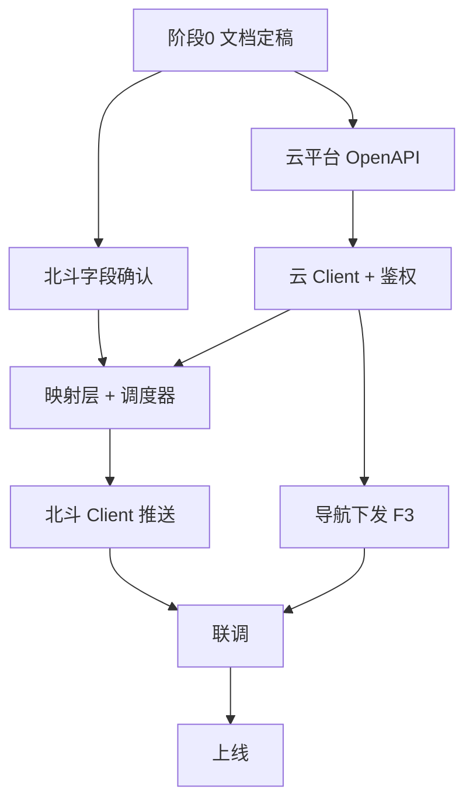

# 中转程序第一期设计定稿

> **版本**：V1.0（草案，待评审签字）  
> **范围**：严格依据《中转系统与北斗系统交互协议0629》两个 HTTP 接口；面向**少量车辆**（建议 1～10 台，可配置扩展）。  
> **架构位置**：车端 →（MQTT）→ 云平台 →（HTTP 鉴权）→ **中转程序** →（HTTP 内网）→ 北斗系统  

---

## 1. 第一期功能范围

### 1.1 纳入范围

| 编号 | 能力 | 方向 | 说明 |
|------|------|------|------|
| F1 | 注册北斗回调 | 北斗 → 中转 | 北斗 POST 回调 URL 与推送频率 |
| F2 | 定时推送车辆状态 | 中转 → 北斗 | 按 frequency 向北斗 url POST 状态 |
| F3 | 反控导航至坐标 | 北斗 → 中转 → 云 | 北斗 POST 物理坐标，中转下发云侧导航任务 |

### 1.2 不纳入范围（第一期）

- 北斗协议未出现的：终端注册/注销、历史轨迹、围栏、批量接口、鉴权等  
- 中转直连 EMQX / 车端 MQTT  
- 1010003 高频轨迹、全量感知/告警同步（仅映射到协议已有 `isAlert` / `alertList[]`）  
- 管理后台、多租户、主备集群（可预留，不实现）  

### 1.3 少量车辆策略

第一期采用 **「配置驱动 + 按车推送」**：

- 中转本地维护 **车辆清单**（`vehicleId` / `clientId` / 可选北斗侧标识）。  
- 北斗注册 **一个** 回调 URL 时：中转对该 URL **按 frequency 周期轮询各车状态**，**每车 POST 一次**（或经与北斗确认后改为批量，协议当前为单车 `data` 结构）。  
- 北斗下发导航时：须在请求中携带 **`vehicleId`**（协议原文未写，见 §6.1 待确认项；第一期建议扩展，否则无法区分目标车）。  

---

## 2. 网络与部署

```
┌─────────┐   MQTT    ┌──────────┐   HTTP+鉴权   ┌──────────┐   HTTP内网   ┌──────────┐
│  车端   │ ────────► │ 云平台   │ ◄──────────► │ 中转程序 │ ◄──────────► │ 北斗系统 │
└─────────┘           └──────────┘               └──────────┘               └──────────┘
```

| 链路 | 协议 | 鉴权 | 备注 |
|------|------|------|------|
| 车 ↔ 云 | MQTT（内部标准版） | EMQX 设备认证 | 中转不介入 |
| 云 ↔ 中转 | HTTP/HTTPS | **必须鉴权** | 需云平台提供 OpenAPI |
| 中转 ↔ 北斗 | HTTP | **内网无业务鉴权** | 建议 IP 白名单 + 仅监听内网网卡 |

**部署建议（第一期）**：单实例进程 + 配置文件；与北斗同网段或可达内网；云侧走专线/VPN/公网 HTTPS 均可。

---

## 3. 接口定稿

> 协议原文 IP/路径为「待定」。下表为**建议定稿值**，评审通过后写入联调环境文档，并同步北斗方改协议附录。

### 3.1 中转暴露给北斗的接口（Server）

**Base URL**：`http://{中转内网IP}:{端口}`（示例：`http://10.x.x.x:8080`）

#### 3.1.1 注册回调地址（对应协议「接口 1」）

| 项目 | 定稿值 |
|------|--------|
| Path | `POST /api/v1/beidou/callback/register` |
| Content-Type | `application/json` |

**请求 Body**

```json
{
  "url": "http://10.x.x.x:yyyy/beidou/callback/vehicle-status",
  "frequency": 4000
}
```

| 字段 | 类型 | 必填 | 说明 |
|------|------|------|------|
| url | string | 是 | 北斗提供的 HTTP 回调地址，中转向该地址 POST 状态 |
| frequency | int | 是 | 推送周期，单位 **毫秒**，**3000～5000**（与北斗确认） |

**响应 Body（中转定义，`vehicleIds` 在响应中返回）**

```json
{
  "code": 0,
  "message": "success",
  "data": {
    "registeredAt": 1740469352000,
    "frequency": 4000,
    "vehicleCount": 2,
    "vehicleIds": ["lingu_test2", "robot-002"],
    "vehicles": [
      {
        "vehicleId": "lingu_test2",
        "online": true,
        "workStatus": 1,
        "battery": 85,
        "position": { "x": 114.398441, "y": 22.702372 },
        "taskName": "mock-task",
        "updatedAt": 1740469352000
      }
    ]
  },
  "timestamp": 1740469352000
}
```

| code | 含义 |
|------|------|
| 0 | 成功 |
| 400 | 参数非法（url 为空、frequency ≤ 0） |
| 500 | 内部错误 |

**行为说明**

- 重复 register：**url / frequency 未变**时不重启推送，仅刷新响应快照；**变更时**停止旧任务并重启。  
- 服务重启：配置持久化到本地文件（`data/beidou-callback.json`），恢复后继续调度。  
- register 时中转按 **vehicles.yaml 启用列表** 确定 `vehicleIds`，查云平台后在**响应**中返回各设备当前快照。  

---

#### 3.1.2 反控导航（对应协议「接口 2」）

| 项目 | 定稿值 |
|------|--------|
| Path | `POST /api/v1/beidou/navigation` |
| Content-Type | `application/json` |

**请求 Body（在协议基础上增加 vehicleId，少量车辆必需）**

```json
{
  "vehicleId": "V001",
  "x": 21.64,
  "y": 86.28,
  "z": 1.42,
  "direction": 82,
  "floor": 1
}
```

| 字段 | 类型 | 必填 | 说明 |
|------|------|------|------|
| vehicleId | string | 是 | 云平台车辆 ID，须在 §4.1 配置中存在 |
| x | double | 是 | 物理 X 坐标（米） |
| y | double | 是 | 物理 Y 坐标（米） |
| z | double | 是 | 见 §5.2 语义待确认 |
| direction | int | 是 | 车辆方向，见 §5.2 |
| floor | int | 是 | 楼层 |

**响应 Body（中转定义）**

```json
{
  "code": 0,
  "message": "success",
  "data": {
    "vehicleId": "V001",
    "cloudTaskId": "BD-NAV-1740469352001",
    "acceptedAt": 1740469352000
  },
  "timestamp": 1740469352000
}
```

| code | 含义 |
|------|------|
| 0 | 已接受并下发云平台 |
| 400 | 参数错误或 vehicleId 不在配置中 |
| 404 | 车辆在云平台不存在或离线 |
| 502 | 云平台调用失败 |
| 500 | 内部错误 |

**行为说明**

- 第一期为 **同步受理**：云平台接口返回成功即 `code: 0`；**不等待** 车端到达目标点。  
- 下发云侧等价于 **2010001 即时单点导航任务**（见 §5.3）。  

---

#### 3.1.3 健康检查（运维，非北斗协议）

| Path | Method | 说明 |
|------|--------|------|
| `/health` | GET | 返回 `{"status":"up"}`，供部署探活 |

---

### 3.2 中转调用北斗的接口（Client）

#### 3.2.1 推送车辆状态（协议「接口 1」后半段）

| 项目 | 值 |
|------|-----|
| URL | 由注册接口传入的 `url` |
| Method | POST |
| Content-Type | `application/json` |

**请求 Body（每车一次；少量车辆时同一周期内依次 POST）**

```json
{
  "data": {
    "vehicleId": "V001",
    "x": 21.64,
    "y": 86.28,
    "z": 1.42,
    "floor": 1,
    "state": 1,
    "powerLevel": 85.0,
    "currentTask": "T001",
    "isAlert": false,
    "alertList": [],
    "direction": 82
  },
  "timestamp": 1740469352000
}
```

> **说明（0629）**：`vehicleId` 在 `data` 内；多车场景每车独立 POST 一次。

**北斗响应**

```json
{
  "code": 1000,
  "msg": "成功",
  "timestamp": 1603252608889
}
```

| 北斗 code | 中转处理 |
|-----------|----------|
| 1000 | 成功，记录最后成功时间 |
| 其他 | 记错误日志；可选有限次重试（见 §5.4） |

---

### 3.3 中转调用云平台的接口（Client，待云平台补 OpenAPI）

以下为 **逻辑能力**，具体 Path/Header 以云平台文档为准。

| 能力 ID | 用途 | 触发 | 建议频率 |
|---------|------|------|----------|
| CLOUD-AUTH | 登录 / 刷新 Token | 启动、Token 将过期 | 按 Token TTL |
| CLOUD-STATUS | 查询单车最新状态 | F2 定时推送 | 每车每周期 1 次 |
| CLOUD-NAV | 下发即时导航任务 | F3 反控 | 按请求 |

**CLOUD-STATUS 期望字段**（等价 1010001，可来自 Telemetry 聚合 API）：

- `position_xyz`（或拆开的 x, y, yaw）  
- `workStatus`、`battery`、`taskId`  
- `heading`（若有）  
- `faultSummary` 或告警摘要（若有）  

**CLOUD-NAV 期望语义**（等价 2010001）：

- `executionMode`: `IMMEDIATE`  
- `taskId`: 中转生成，前缀 `BD-NAV-`  
- 单节点坐标：`x`, `y`, `z`, `w`（若云侧用四元数）  

---

## 4. 配置定稿

### 4.1 车辆清单（`config/vehicles.yaml` 示例）

```yaml
vehicles:
  - vehicleId: "V001"
    clientId: "robot-001"          # MQTT clientId，与云侧一致
    floor: 1                       # 默认楼层，1010001 无 floor 时使用
    enabled: true
  - vehicleId: "V002"
    clientId: "robot-002"
    floor: 1
    enabled: true
```

### 4.2 云平台连接（`config/cloud.yaml` 示例）

```yaml
cloud:
  baseUrl: "https://cloud.example.com/api"
  auth:
    type: "oauth2_client_credentials"   # 或 api_key，以云侧为准
    clientId: "${CLOUD_CLIENT_ID}"
    clientSecret: "${CLOUD_CLIENT_SECRET}"
  timeoutMs: 5000
```

### 4.3 服务（`config/server.yaml` 示例）

```yaml
server:
  host: "0.0.0.0"
  port: 8080
  allowedBeidouIps: ["10.0.0.0/8"]     # 可选白名单
push:
  retryTimes: 2
  retryIntervalMs: 500
```

---

## 5. 数据映射定稿

### 5.1 云 → 北斗（状态推送）

| 北斗字段 | 类型 | 云侧来源 | 转换规则 |
|----------|------|----------|----------|
| x | double | `position_xyz[0]` | 地图 X，米 |
| y | double | `position_xyz[1]` | 地图 Y，米 |
| z | double | 见 §5.2 | **待确认** |
| floor | int | 配置 `vehicles[].floor` | 1010001 无此字段 |
| state | int | `workStatus` | 0 空闲；1 任务中；2 故障；3 充电；4 急停 |
| powerLevel | double | `battery` | int → double |
| currentTask | string | `taskId` | 无则 `""` |
| isAlert | boolean | `faultSummary.hasFault` 或告警 API | true/false |
| alertList | array | 云侧 `errors` / 故障文案 | 无告警 `[]`；有告警 `[{ alertType, alertMsg }]` |
| direction | int | `heading` 或 yaw 换算 | **待确认单位** |

### 5.2 待确认字段语义（阻塞映射实现）

| 字段 | 问题 | 建议默认（仅联调前临时使用） |
|------|------|------------------------------|
| z | 云 `position_xyz` 第三段为 **yaw 弧度**；北斗注释为「物理 z 坐标」 | 与北斗确认前：推送 **高度 0.0** 或 **忽略第三段** |
| direction | 度 / 0~360 整数 / 弧度 | 暂用 `heading` 四舍五入为 int |
| alertList[].alertType | 枚举未定义 | 有告警时单条填 `1`，无告警 `[]` |

### 5.3 北斗 → 云（反控导航）

| 北斗字段 | 云侧（2010001） |
|----------|----------------|
| vehicleId | 解析为 `clientId`，调云 API 指定设备 |
| x, y | `taskNodes[0].x`, `.y` |
| z, direction | 若云用四元数：由 direction 算 `z/w`；若云接受 yaw：写入约定字段 |
| floor | 第一期可忽略或写入扩展字段 |

**任务模板（逻辑）**

```json
{
  "taskId": "BD-NAV-{timestamp}",
  "executionMode": "IMMEDIATE",
  "taskNodes": [
    {
      "order": 1,
      "taskPoint": "",
      "duration": "0",
      "x": 21.64,
      "y": 86.28,
      "z": 0.0,
      "w": 1.0
    }
  ]
}
```

> `z/w` 具体值依赖云平台 API 文档与 direction 换算规则。

### 5.4 推送失败与重试（第一期）

- 单次推送失败：最多重试 2 次，间隔 500ms。  
- 仍失败：写日志 + 记录该车 `lastPushError`；下一周期继续，不阻塞其他车。  
- 不做长期离线队列（第二期可按需加）。  

---

## 6. 仍缺少的资料清单

按 **谁提供**、**优先级** 列出。资料不齐时可并行开发 **中转骨架 + Mock 云**，但 **联调前必须齐 P0**。

### 6.1 北斗方（P0 = 联调前必须）

> **详细需求见：[北斗-对接需求.md](./北斗-对接需求.md)**（可直接发给北斗方填写 §10 回复栏）

| # | 资料 | 用途 | 状态 |
|---|------|------|------|
| B1 | 中转程序 **内网 IP、端口** | 北斗配置回调与反控目标 | ❌ 待定 |
| B2 | 北斗 **回调 url 完整路径** 及测试环境地址 | F2 联调 | ❌ 待定 |
| B3 | 多车推送：`vehicleId` 在 `data` 内（0629） | 多车推送方案 | ✅ 0629 已定 |
| B4 | 字段 **z** 含义：高程 / 航向 / 其它 | 映射 | ❌ 待确认 |
| B5 | 字段 **direction** 单位与范围 | 映射 + 反控 | ❌ 待确认 |
| B6 | **alertList[].alertType** 枚举表 | 告警映射 | ❌ 待确认 |
| B7 | **frequency** 允许最小值、最大值 | 限流与调度 | ❌ 待确认 |
| B8 | 联调环境 **网络拓扑**（与协议拓扑图一致的文字版） | 防火墙放行 | ❌ 待定 |
| B9 | 接口 2 是否必须带 **vehicleId**（中转扩展） | 多车反控 | ❌ 待北斗签字确认 |

### 6.2 云平台方（P0 = 开发 CLOUD-* 前必须）

> **详细需求见：[云平台-对接需求.md](./云平台-对接需求.md)**（可直接发给云平台团队填写 §8 回复栏）

| # | 资料 | 用途 | 状态 |
|---|------|------|------|
| C1 | 中转专用 **HTTP OpenAPI**（Swagger/文档） | 开发云 Client | ❌ 缺失 |
| C2 | **鉴权方式**：OAuth2 / API Key / JWT 及示例 | CLOUD-AUTH | ❌ 缺失 |
| C3 | **按 vehicleId 或 clientId 查最新状态** 的接口 | F2 | ❌ 缺失 |
| C4 | **下发即时导航/2010001 等价 HTTP** 接口 | F3 | ❌ 缺失 |
| C5 | **vehicleId ↔ clientId ↔ iotId** 对照规则 | 配置与调用 | ❌ 缺失 |
| C6 | dev/test **baseUrl**、测试账号 | 联调 | ❌ 缺失 |
| C7 | API **限流**（QPS、并发） | 少量车轮询估算 | ❌ 缺失 |
| C8 | 在线判定：离线车是否仍推送 / 推送何种 state | F2 行为 | ❌ 待确认 |

### 6.3 我方（中转项目组）

| # | 资料 | 用途 | 状态 |
|---|------|------|------|
| O1 | 第一期 **车辆清单**（vehicleId、clientId、floor） | vehicles.yaml | ❌ 待业务提供 |
| O2 | 部署环境（OS、内网 IP、是否 Docker） | 上线 | ❌ 待定 |
| O3 | 本文档 **评审签字** | 开工基线 | 🔄 本文档 |
| O4 | 联调用例（见 §8） | 验收 | 🔄 可随开发补充 |

### 6.4 已有资料

| 资料 | 说明 |
|------|------|
| 《中转系统与北斗系统交互协议0629.docx》 | 北斗 ↔ 中转 HTTP 行为（正式版） |
| 《云平台-机器人通信协议-内部标准版》 | 车云 MQTT 字段语义（1010001 / 2010001） |
| 《RPC 接口参考.md》 | 云实现参考，非中转直连接口 |

---

## 7. 开发大体流程

### 7.1 阶段总览

```
阶段0 定稿评审 → 阶段1 云/北斗资料到位 → 阶段2 设计与骨架
    → 阶段3 核心功能 → 阶段4 联调 → 阶段5 上线与观察
```

### 7.2 各阶段说明

#### 阶段 0：文档定稿（当前，约 3～5 天）

1. 评审本文档：URL、响应码、多车 `vehicleId` 扩展。  
2. 三方对齐 §6 缺失项，输出 **《第一期联调环境表》**（IP、端口、账号、车辆列表）。  
3. 云平台承诺 OpenAPI 交付日期。  

**产出**：签字版设计定稿 + 联调环境表 + 资料缺口跟踪表。

---

#### 阶段 1：资料与 Mock（与阶段 2 可部分并行，约 1 周）

1. 云平台提供 OpenAPI（至少 CLOUD-AUTH + CLOUD-STATUS + CLOUD-NAV）。  
2. 北斗确认 B3～B7、B9。  
3. 中转侧准备 **Mock 云 API**（返回固定 1010001 结构），Mock 北斗回调（打印 Body）。  

**产出**：OpenAPI 文件、Mock 服务、车辆配置样例。

---

#### 阶段 2：项目骨架（约 3～5 天）

1. 选型（Go/Java/Node 等）+ 仓库初始化。  
2. HTTP Server：`/health`、注册接口、导航接口。  
3. 配置加载：`vehicles.yaml`、`cloud.yaml`。  
4. 日志、统一错误响应、配置持久化（北斗注册信息）。  

**产出**：可启动空壳，接口通 Postman，返回 mock。

---

#### 阶段 3：核心功能（约 1～2 周）

| 顺序 | 模块 | 内容 |
|------|------|------|
| 3.1 | 云鉴权 Client | Token 获取与自动刷新 |
| 3.2 | 云状态 Client | 按 vehicleId 拉最新状态 |
| 3.3 | 字段映射层 | 1010001 → 北斗 data；单元测试 |
| 3.4 | 调度器 | 注册后按 frequency 轮询 enabled 车辆并 POST 北斗 |
| 3.5 | 北斗 HTTP Client | 超时、重试、解析 code 1000 |
| 3.6 | 导航下发 | 接口 2 → CLOUD-NAV（2010001 等价） |
| 3.7 | direction/四元数换算 | 依赖 C4 与 B5 确认后实现 |

**产出**：对接 Mock 全链路跑通。

---

#### 阶段 4：联调（约 1～2 周）

1. **云 ↔ 中转**：真实鉴权、真实状态、真实下发任务。  
2. **中转 ↔ 北斗**：注册 → 定时推送 → 北斗返回 1000。  
3. **端到端**：北斗反控 → 云下发 → 车动 → 推送 state 变化。  
4. 异常：云 Token 过期、单车离线、北斗 url 不可达、重复注册。  

**产出**：联调记录、问题清单、验收签字。

---

#### 阶段 5：上线与观察（约 3～5 天）

1. 生产/准生产配置与防火墙。  
2. 监控：推送成功率、导航受理成功率、云 API 延迟。  
3. 少量车辆灰度，观察 24～72 小时。  

**产出**：上线 checklist、运维说明（配置变更、日志路径）。

---

### 7.3 工期粗估（少量车辆、资料按时到位）

| 阶段 | 工期 |
|------|------|
| 0 定稿 | 3～5 天 |
| 1～3 开发 | 2～3 周 |
| 4 联调 | 1～2 周 |
| 5 上线 | 3～5 天 |
| **合计** | **约 4～6 周** |

> 若 C1～C4 OpenAPI 延迟，可先 Mock 开发，但总工期不变，联调窗口后移。

---

### 7.4 开发顺序依赖图



---

## 8. 第一期验收用例（摘要）

| 编号 | 场景 | 预期 |
|------|------|------|
| T1 | 北斗注册 url + frequency | 返回 code 0，配置持久化 |
| T2 | 3 台 enabled 车，frequency=1000 | 1 秒内各 POST 北斗 1 次，含 vehicleId |
| T3 | 云 status 变更 | 下一周期北斗收到新 state/battery |
| T4 | 北斗 POST 导航 + vehicleId | 云产生 BD-NAV 任务，返回 code 0 |
| T5 | 未知 vehicleId 导航 | 400 |
| T6 | 云 API 失败 | 502 + 日志 |
| T7 | 服务重启 | 注册信息保留，调度恢复 |
| T8 | 北斗返回非 1000 | 重试后记错，不影响其他车 |

---

## 9. 评审签字栏（模板）

| 角色 | 单位 | 签字 | 日期 |
|------|------|------|------|
| 产品/业务 | | | |
| 北斗对接 | | | |
| 云平台 | | | |
| 中转开发 | | | |

---

## 10. 修订记录

| 版本 | 日期 | 说明 |
|------|------|------|
| V1.0 | 2026-06-29 | 第一期定稿草案：两接口 + 少量车辆 + 资料清单 + 开发流程 |
