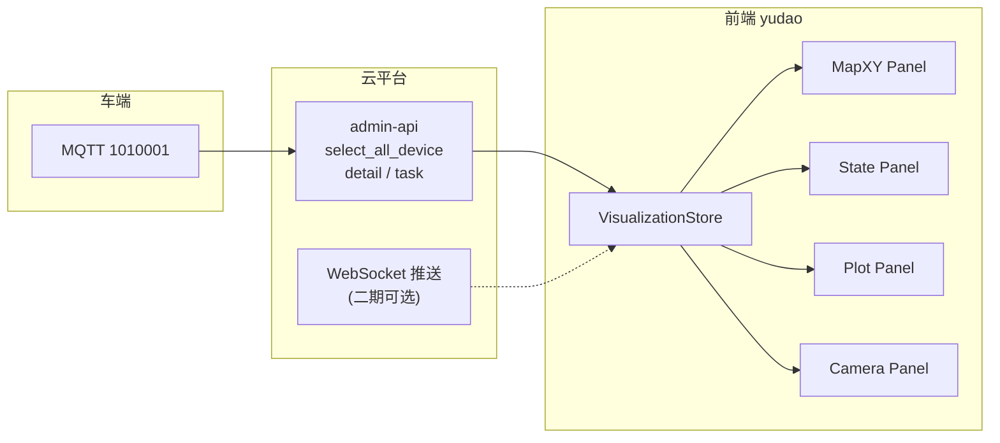

# 地图可视化方案（Foxglove 参考版）

> **版本**：V1.0  
> **日期**：2026-07-01  
> **适用范围**：`yudao-ui-admin-vue3` 车辆监控 / 地图定位 / 车队可视化  
> **目的**：借鉴 Foxglove 的**面板化、时序化、多模态**交互思路，在芋道管理后台内实现**室内 AGV 2D 可视化**；不依赖 Foxglove 闭源产品嵌入。

---

## 1. 方案定位

### 1.1 Foxglove 学什么、不学什么

| Foxglove 概念 | 本方案借鉴方式 | 不采用的原因 |
|---------------|----------------|--------------|
| **多 Panel 布局**（地图 + 曲线 + 图像 + 状态） | yudao 内用「可拖拽栅格布局」或固定三栏 | Foxglove 2.x 闭源，无法 iframe 嵌入 |
| **时间轴 / 回放** | 底部时间条 + 历史轨迹缓冲（RingBuffer） | 第一期可先 live-only，第二期接 MCAP 或云历史 |
| **Topic 订阅模型** | 前端统一 `VisualizationStore`，按 deviceId 订阅 channel | 与 HTTP 轮询 / WebSocket 解耦，便于以后换数据源 |
| **Map Panel（GPS）** | 改为 **室内 MapXY Panel**（米制栅格 + 站点层） | 你们是 `position_xyz` 米坐标，不是 WGS84 |
| **3D Panel** | 第一期不做；必要时用 2.5D（带航向三角形） | 1～10 台室内 AGV，2D 足够 |
| **Image Panel** | 监控页五路相机区对齐 Foxglove 多图布局 | 视频流协议待云侧确认 |
| **Plot / State Transitions** | ECharts 折线 + 状态色带 | 可直接用 Element Plus + ECharts |
| **MCAP 录制回放** | 第二期：云或中转写 MCAP，Foxglove 仅作**工程师外挂工具** | 运营 UI 仍走 yudao |

### 1.2 与现有页面的关系

```
/car/car/index.vue          → 车队表格（已有，保持业务入口）
/map/location/index.vue     → 【待建】车队地图总览（Foxglove 风格多车视图）
/car/car/monitor/:vehicleId → 【待升级】单车监控工作台（多 Panel）
```

当前 `monitor/index.vue` 为 SVG mock，本方案将其升级为**数据驱动 + Panel 化**结构。

---

## 2. 总体架构

### 2.1 数据流



### 2.2 前端分层（建议目录）

```
src/views/car/visualization/
├── types.ts                 # VizMessage、MapLayer、PanelLayout
├── store/useVisualizationStore.ts
├── adapters/
│   ├── fromVehicleStatus.ts # VehicleStatusVO → Viz 消息
│   └── pollFleetStatus.ts   # 复用 VehicleApi，1Hz 轮询
├── panels/
│   ├── MapXYPanel.vue       # 室内 2D 地图（核心）
│   ├── StatePanel.vue       # 状态卡片 + 状态时间线
│   ├── PlotPanel.vue        # 电量/速度曲线（ECharts）
│   ├── CameraPanel.vue      # 多路相机
│   └── TaskPathPanel.vue    # 规划路径 / 已走轨迹
├── components/
│   ├── VizLayout.vue        # 栅格布局壳（参考 Foxglove Layout）
│   ├── PlaybackBar.vue      # 时间轴（二期）
│   └── MapToolbar.vue       # 缩放、跟随、测距
└── composables/useMapTransform.ts  # 世界坐标 ↔ 屏幕坐标

src/views/map/location/index.vue    # 车队页：仅 MapXY + 侧边列表
src/views/car/car/monitor/index.vue # 单车页：完整 VizLayout
```

---

## 3. 可视化数据模型（对标 Foxglove Topic）

Foxglove 用 **Topic + Schema** 组织数据；我们在前端定义等价 **Channel**，便于 Panel 订阅。

### 3.1 Channel 定义

| Channel ID | 来源字段（1010001 / HTTP） | 更新频率 | 用途 |
|------------|---------------------------|----------|------|
| `/{deviceId}/pose` | `position_xyz` + `heading` | 1Hz（跟车端） | 地图上的车位 + 航向 |
| `/{deviceId}/state` | `workStatus`, `online`, `battery` | 1Hz | 状态 Panel、地图图标颜色 |
| `/{deviceId}/task` | `taskId`, `taskName` | 变更时 | 任务信息条 |
| `/{deviceId}/path/history` | 前端累积 pose 序列 | 1Hz 写入 buffer | 历史轨迹线 |
| `/{deviceId}/path/planned` | 任务节点 / 2010001 taskNodes | 任务变更时 | 规划虚线（二期） |
| `/{deviceId}/alerts` | `faultSummary`, `alertMsg` | 变更时 | 告警条、地图闪烁 |
| `/fleet/snapshot` | `select_all_device` 全量 | 1～3s | 车队地图多车 |

### 3.2 核心 TypeScript 类型（实现时复制到 `types.ts`）

```typescript
/** 世界坐标系：与协议 position_xyz 一致，单位米，Z 轴为 yaw 弧度 */
export interface MapPose {
  deviceId: string
  x: number
  y: number
  yawRad: number
  headingDeg?: number
  timestamp: number
}

export interface DeviceStateSnapshot {
  deviceId: string
  online: boolean
  workStatus: 0 | 1 | 2 | 3 | 4
  battery: number
  taskId?: string
  taskName?: string
  alertMsg?: string
  hasFault: boolean
  timestamp: number
}

/** 单帧可视化快照（一次轮询或 WS 推送） */
export interface VizFrame {
  timestamp: number
  poses: MapPose[]
  states: DeviceStateSnapshot[]
}

/** 轨迹缓冲：Foxglove Map「History mode」等价物 */
export interface PathBuffer {
  deviceId: string
  maxPoints: number        // 建议 300（约 5 分钟 @1Hz）
  points: MapPose[]
}
```

### 3.3 状态 → 视觉编码（Foxglove State Transitions 简化版）

| workStatus | 中文 | 地图图标色 | 标签 |
|------------|------|------------|------|
| 0 | 空闲 | `#E67E22` | 橙 |
| 1 | 任务中 | `#3498DB` | 蓝 |
| 2 | 故障 | `#E74C3C` | 红 + 脉冲动画 |
| 3 | 充电 | `#F39C12` | 黄 |
| 4 | 急停 | `#C0392B` | 深红 + 停止 icon |

离线：`#95A5A6`，透明度 0.5，不绘制轨迹延伸。

---

## 4. 页面设计（具体布局）

### 4.1 车队地图页 `/map/location`（Foxglove Map + Device List）

**参考**：Foxglove Map Panel（History: all points）+ 左侧 Device 列表。

```
┌─────────────────────────────────────────────────────────────────┐
│ 地图定位                                    [刷新] [跟随全部]    │
├──────────────┬──────────────────────────────────────────────────┤
│ 设备列表      │  MapXY Panel（主区域）                            │
│ ─────────── │  · 底图：栅格 / 导入 PNG 站点地图（二期）          │
│ ● LU2606…   │  · 多车三角形图标 + 航向                           │
│   在线 37%  │  · 历史轨迹（细线，每车一色）                       │
│ ○ YW1004    │  · 比例尺（Foxglove Map scale 等价）               │
│   离线      │  · 鼠标悬停：deviceId / 坐标 / 状态 tooltip        │
│              │  [+] [-] [复位] [测距]                            │
├──────────────┴──────────────────────────────────────────────────┤
│ 图例：空闲 任务中 故障 充电 急停 离线                              │
└─────────────────────────────────────────────────────────────────┘
```

| 项 | 规格 |
|----|------|
| 轮询 | `VehicleApi.getVehicleStatusList()`，**3s**（列表页 3s，监控页 1s） |
| 地图引擎 | **Konva.js** 或 **Canvas 2D**（轻量）；站点数 >50 再考虑 PixiJS |
| 坐标变换 | 世界 (x,y) 米 → 屏幕；Y 轴**向上**与地图系一致，注意 Canvas Y 向下需翻转 |
| 默认视口 | 所有有效点 bounding box + 10% padding；无有效点时显示空态提示 |
| 点击设备 | 跳转 `/car/car/monitor/{deviceId}` |

### 4.2 单车监控页 `/car/car/monitor/:vehicleId`（Foxglove Layout 工作台）

**参考**：Foxglove 默认 Layout — 左地图、右上图表、右下图像、底部控制。

```
┌─────────────────────────────────────────────────────────────────┐
│ 远程监控 · {deviceId}                    [返回] [全屏地图]     │
├───────────────────────────────┬─────────────────────────────────┤
│                               │  StatePanel                       │
│                               │  在线 | 任务中 | 电量 37%         │
│      MapXY Panel              │  任务：xxx  告警：无               │
│      · 单车放大               ├─────────────────────────────────┤
│      · 规划路径(虚线)         │  PlotPanel                        │
│      · 已走轨迹(实线)         │  电量曲线 / workStatus 色带       │
│      · 站点/感知框(二期)      │  （最近 10 分钟）                  │
│                               ├─────────────────────────────────┤
│                               │  CameraPanel 2×2 + 1            │
│                               │  前/后/左/右/环视                  │
├───────────────────────────────┴─────────────────────────────────┤
│  PlaybackBar（二期）  ◀  ●──────────────────○  ▶   Live        │
├─────────────────────────────────────────────────────────────────┤
│  远程操作区（保留现有 WASD，与 Foxglove Service Call 分离）        │
└─────────────────────────────────────────────────────────────────┘
```

| Panel | 数据 | Foxglove 对照 |
|-------|------|---------------|
| MapXY | pose + path | 3D Panel 降维版 / 自定义 Map |
| State | state + task + alerts | Raw Messages + 自定义卡片 |
| Plot | battery、workStatus 历史 | Plot Panel + State Transitions |
| Camera | 视频 URL（待 API） | Image Panel × N |
| PlaybackBar | 本地 buffer 或云录像 | Playback 控件 |

### 4.3 车辆列表页（保持现状，增加入口）

列表页**不放大图**（已按产品要求精简列）。增加：

- 操作栏「监控」→ 进入 4.2  
- 「详情」抽屉已含坐标/航向（已实现）  
- 可选：顶部增加「地图总览」按钮 → `/map/location`

---

## 5. MapXY Panel 详细设计（核心）

### 5.1 图层顺序（从下到上）

1. **GridLayer** — 20m 主网格 + 5m 次网格（可配置 `gridStepM`）  
2. **SiteMapLayer**（二期）— PNG/SVG 站点平面图，带 `originX/Y`、`resolution`  
3. **PathLayer** — 每车 `history` 折线，`planned` 虚线  
4. **StationLayer**（二期）— 任务站点圆点，来自 `get_device_task_point`  
5. **VehicleLayer** — 航向三角形 + 选中高亮环  
6. **OverlayLayer** — 比例尺、坐标读数、测距线  

### 5.2 车辆图标（2.5D 等价 Foxglove 3D 箭头）

```
        ▲  航向 = headingDeg 或 yawRad 转度
       / \
      /   \
     └─────┘  中心 = (x, y)
```

- 尺寸：默认 **1.2m** 车长示意（屏幕像素随 zoom 缩放）  
- 选中：外圈虚线圆 + 列表联动  

### 5.3 交互（对标 Foxglove Map 工具栏）

| 操作 | 行为 |
|------|------|
| 滚轮 | 以鼠标为中心 zoom |
| 拖拽 | 平移视口 |
| 双击 | 复位到跟随当前车 |
| 「跟随」开关 | 视口中心锁定选中 deviceId |
| 「测距」 | 两次点击显示欧氏距离（米） |
| 「历史」下拉 | 全部轨迹 / 仅最近点 / 隐藏（同 Foxglove History mode） |

### 5.4 坐标与边界情况

| 场景 | UI 处理 |
|------|---------|
| `position_xyz` 全 0 | 地图中央灰色提示：「等待定位数据」；仍显示状态 Panel |
| 仅 x,y 有效，heading=0 | 画圆点代替箭头 |
| `position` 经纬度回退 | 第二期：Outdoor 模式切换 WGS84（Foxglove Map）；第一期仅 MapXY |
| 多车坐标范围差很大 | 车队页「缩放至全部」；监控页只显示单车附近 50m 范围 |

---

## 6. 数据接入策略

### 6.1 第一期（与现网一致，最小改动）

| 方式 | 说明 |
|------|------|
| HTTP 轮询 | 复用 `VehicleApi.getVehicleStatusList()` |
| 频率 | 车队页 3s；监控页 **1s**（对齐 1010001） |
| 轨迹 | 前端 `PathBuffer` 每次 poll  append pose，超 max 删头 |
| 任务路径 | 暂无 API 时只画 history；有 `taskNodes` 后再画 planned |

```typescript
// adapters/fromVehicleStatus.ts 伪代码
export function toVizFrame(list: VehicleStatusVO[]): VizFrame {
  return {
    timestamp: Date.now(),
    poses: list.filter(v => v.positionXyz).map(v => ({
      deviceId: v.vehicleId,
      x: v.positionXyz!.x,
      y: v.positionXyz!.y,
      yawRad: v.positionXyz!.yaw,
      headingDeg: v.heading,
      timestamp: v.updatedAt
    })),
    states: list.map(v => ({ /* ... */ }))
  }
}
```

### 6.2 第二期（可选，减轻轮询）

| 方式 | 说明 |
|------|------|
| WebSocket | 云推送 `deviceId + pose + state`，前端 VisualizationStore 合并 |
| 历史回放 | 云存时序或 MCAP；`PlaybackBar` 驱动 buffer 回放 |
| 站点地图 | 上传 SLAM 栅格图 + yaml 原点，或 GeoJSON 站点 |

### 6.3 与 Foxglove 外挂并存（给研发）

若工程师已用 Foxglove Desktop：

1. 写小型 **bridge 服务**（Node，可放 beidou-bridge 旁）：HTTP 拉云 → WebSocket 发 Foxglove schema（`PoseInFrame` / 自定义 JSON）  
2. 运营人员仍用 yudao；研发用 Foxglove 看同一份 live 数据  
3. **不要求**运营 UI 嵌入 Foxglove  

---

## 7. 组件接口约定（实现 checklist）

### 7.1 `MapXYPanel.vue`

```typescript
props: {
  poses: MapPose[]
  states: DeviceStateSnapshot[]
  paths: Record<string, PathBuffer>
  selectedDeviceId?: string
  followDeviceId?: string
  historyMode: 'all' | 'latest' | 'none'
  showGrid: boolean
}
emits: ['select-device', 'viewport-change']
```

### 7.2 `useVisualizationStore`

```typescript
// 职责：轮询、buffer、选中车、供各 Panel 订阅
state: {
  fleet: VizFrame | null
  paths: Map<string, PathBuffer>
  selectedDeviceId: string | null
  pollingMs: number
}
actions: {
  startPolling(deviceIds?: string[])
  stopPolling()
  appendFrame(frame: VizFrame)
}
```

### 7.3 `VizLayout.vue`

- 使用 `vue-grid-layout` 或 CSS Grid 固定布局（第一期固定即可，不必拖拽）  
- 二期再加「布局保存到 localStorage」（Foxglove Layout 等价）  

---

## 8. 技术选型建议

| 能力 | 推荐 | 备选 | 不推荐 |
|------|------|------|--------|
| 2D 地图 | Konva + vue-konva | Canvas 手写 | 直接抄 Foxglove 1.x 源码 |
| 曲线 | ECharts（项目已有） | uPlot | — |
| 状态时间线 | 自绘 CSS + ECharts custom | — | — |
| 视频 | `<video>` + flv.js/hls.js | WebRTC | — |
| 状态管理 | Pinia store | — | — |
| 回放 | 自研 PlaybackBar + buffer | MCAP.js 浏览器读 | 第一期上 Foxglove 嵌入 |

---

## 9. 分阶段实施计划

### Phase 0 — 基础数据（已完成 / 进行中）

- [x] 车辆列表对接 `select_all_device`  
- [x] `VehicleStatusVO` 对齐 1010001  
- [ ] 确认 `position_xyz` / `heading` 现场非 0  

### Phase 1 — 可视化 MVP（建议 1～2 周）

| 任务 | 产出 |
|------|------|
| 建 `visualization/` 目录与 store | 数据层就绪 |
| 实现 `MapXYPanel` + 坐标变换 | 可单测渲染 mock 轨迹 |
| 升级 `monitor/index.vue` 为 VizLayout | 单车地图 + StatePanel |
| 实现 `map/location/index.vue` 车队页 | 多车 + 列表联动 |
| 1s / 3s 轮询 + PathBuffer |  live 轨迹 |

**验收**：LU2606000100 在监控页能看到 moving（或静态）点位；车队页多车图标；离线车灰显。

### Phase 2 — 增强（2～4 周）

- PlotPanel 电量 / 状态色带  
- CameraPanel 接真实流  
- 站点层 + `get_device_task_point`  
- 规划路径（2010001 taskNodes）  
- PlaybackBar + 云历史或本地 buffer 导出  

### Phase 3 — 研发工具链（可选）

- MCAP 录制（中转或云）  
- Foxglove WebSocket bridge  
- 布局保存 / 多 Layout 模板  

---

## 10. 与 Foxglove 功能对照表（给负责人）

| Foxglove Panel | 本方案 Panel | 第一期 | 说明 |
|----------------|--------------|--------|------|
| Map (GPS) | MapXY | ✅ | 室内米制，非 GPS |
| 3D Scene | MapXY 2.5D | ✅ | 箭头表示航向 |
| Plot | PlotPanel | ⏳ Phase 2 | 电量等 |
| State Transitions | StatePanel 色带 | ⏳ Phase 2 | workStatus |
| Image × N | CameraPanel | ⏳ | 待视频 API |
| Raw Messages | 已有详情抽屉 | ✅ | 列表详情 |
| Playback | PlaybackBar | ⏳ Phase 2 | — |
| Layout 分享 | localStorage | ⏳ Phase 2 | 非必须 |

---

## 11. 风险与约束

1. **定位字段为 0**：地图无意义但不阻塞；UI 必须有空态，避免假轨迹。  
2. **Foxglove 非开源主产品**：方案是**参考交互**，不是依赖其代码。  
3. **轮询 10 车 × 1Hz**：HTTP 压力可接受；超过 30 车建议 WebSocket。  
4. **yudao 风格统一**：Panel 内用 Element Plus 变量色，不照搬 Foxglove 暗色主题（监控页地图区可局部深色）。  

---

## 12. 参考链接

- [Foxglove 官方](https://foxglove.dev/)  
- [Foxglove 2 vs 1（开源策略变更）](https://foxglove.dev/blog/foxglove-2-vs-foxglove-1)  
- [Foxglove SDK / WebSocket](https://github.com/foxglove/foxglove-sdk)  
- [MCAP 格式](https://mcap.dev/)  
- 本项目：`beidou-bridge/docs/1010001字段与北斗映射.md`  
- 本项目：`yudao-ui-admin-vue3/src/api/car/vehicle/`  

---

## 13. 修订记录

| 版本 | 日期 | 说明 |
|------|------|------|
| V1.0 | 2026-07-01 | 初版：Panel 布局、Channel 模型、MapXY 规格、分期计划 |
